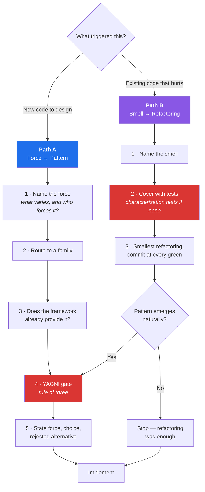

# patterns-and-refactoring

**A Claude Code skill that forces a deliberate design decision before any code gets written — and a disciplined, test-backed process before any code gets restructured.**

[](LICENSE)
[](https://docs.claude.com/en/docs/claude-code)
[](#recommended--plugin-from-the-marketplace)
[](#installation)
[](#whats-inside)
[](#repository-layout)
[](#whats-inside)

> [!NOTE]
> This skill is **standalone**. It needs no MCP server, no other skill, and no runtime. It is Markdown that changes how the model reasons about design. It ships two ways: as a **plugin** from this repo's marketplace (recommended — versioned, updatable) or as a **plain skill directory** copied into `~/.claude/skills`.

---

## Table of contents

- [The problem](#the-problem)
- [Why this matters now: the legacy modernization wave](#why-this-matters-now-the-legacy-modernization-wave)
- [How it works](#how-it-works)
- [What's inside](#whats-inside)
- [Installation](#installation)
- [Usage](#usage)
- [Repository layout](#repository-layout)
- [Design decisions](#design-decisions)
- [Contributing](#contributing)
- [Attribution and sources](#attribution-and-sources)
- [License](#license)

---

## The problem

An AI coding assistant, left alone, will write code that works. That is a lower bar than it sounds.

It will also, reliably:

- reach for a pattern because the name fits, not because the problem calls for it
- build an interface with exactly one implementation "for flexibility"
- refactor and change behaviour in the same commit
- restructure code that has no tests, and declare it improved
- hand-roll a Chain of Responsibility next to the framework's own `Pipeline`
- and, most expensively, produce a design that *reads* sophisticated while making the next change harder

None of this is a knowledge gap. The catalogue is well documented and well represented in training data. It is a **process** gap: the decision of *whether a pattern is warranted at all* gets skipped, because writing the code is more immediately rewarding than justifying its shape.

This skill inserts that decision, and makes it cheap enough to actually happen.

> [!IMPORTANT]
> The skill's most-used output is **"no pattern needed — write the direct code."** It is a brake as much as a catalogue. A tool that only ever suggests adding abstraction is not helping.

---

## Why this matters now: the legacy modernization wave

The dominant kind of software work is no longer greenfield. It is **carrying existing systems onto modern stacks** — and pattern literacy is precisely what separates a modernization that pays off from one that reproduces the old design in a new framework.

### The scale of the estate

| Metric | Figure | Source |
|---|---:|---|
| Legacy/application modernization market, 2025 | **~$25–30B** | Aggregate of five research firms ([Pragmatic Coders](https://www.pragmaticcoders.com/resources/legacy-code-stats)) |
| Projected market, 2031–2034 | **$66–90B+** (14.9–17.6% CAGR) | [Mordor Intelligence](https://www.mordorintelligence.com/industry-reports/legacy-modernization-market) |
| COBOL still running in production | **~200–300 billion lines** | [Pragmatic Coders](https://www.pragmaticcoders.com/resources/legacy-code-stats) |
| Average age of a COBOL developer | **~55**, with ~10% of the workforce retiring annually | [Adalo](https://www.adalo.com/posts/b2b-reliance-legacy-coding-languages-stats) |

### What it costs to not deal with it

| Metric | Figure | Source |
|---|---:|---|
| Technical debt as a share of technology estate value | **20–40%** (CIO estimates) | [McKinsey](https://www.mckinsey.com/capabilities/mckinsey-digital/our-insights/tech-debt-reclaiming-tech-equity) |
| Technical debt as a share of IT budget | **~40%**, rising to 60–80% with heavy on-prem estates | [SIG](https://www.softwareimprovementgroup.com/blog/technical-debt-and-it-budgets/) |
| Developer time spent on technical debt | **13.5 of 41.1 hours/week** (≈33%) | [Stripe, *The Developer Coefficient*](https://stripe.com/reports/developer-coefficient-2018) |
| Developer time wasted on bad legacy code | **17.3 hours/week** (self-reported) | Stripe, same report |
| Engineer time freed by paying down debt | **up to 50% more** time on value-generating work | [McKinsey](https://www.mckinsey.com/capabilities/mckinsey-digital/our-insights/tech-debt-reclaiming-tech-equity) |
| SMB IT budget spent "keeping the lights on" | **~70%** | [Synoptek](https://synoptek.com/insights/it-blogs/legacy-system-modernization-cost/) |

<sub>Market-size figures vary meaningfully between research firms and use different scope definitions; treat the ranges as orders of magnitude, not precise measurements. The Stripe figures are self-reported survey data from 2018 and remain the most-cited numbers on developer time allocation.</sub>

### Why a *pattern* skill is the right lever

Roughly a third of global developer effort goes into wrestling existing code, and the single biggest determinant of whether a modernization succeeds is not the target stack. It is whether the team can:

1. **Name what is wrong** — "Shotgun Surgery", not "this code is messy". A named smell carries its own cure.
2. **Establish a safety net before restructuring** — characterization tests, seams, small revertible steps.
3. **Resist redesigning during the port** — migrating behaviour and improving design in the same step means no bisectable failure and no rollback.
4. **Recognise which patterns the new stack already provides** — most modernizations that "add architecture" are reimplementing what the framework ships.
5. **Refuse the big-bang rewrite** — Strangler Fig, one capability at a time, both systems live, delete the old path only at zero traffic.

Those five behaviours are exactly what this skill encodes. AI assistants are now doing a large share of modernization work, and an assistant that will happily restructure an untested legacy module on request is a liability. This skill makes "cover it with tests first" a precondition rather than a suggestion.

> [!WARNING]
> An LLM refactoring untested legacy code is the highest-risk operation in AI-assisted development. It is confident, fast, and has no way to know it broke something. Path B of this skill exists to make that impossible by default.

---

## How it works

Two entry paths, one triage gate.



### The core rule of Path A

> **Never start from the catalogue.** Browsing 22 patterns for one that fits guarantees a fit.

Start from the problem. Every design pattern answers exactly one question:

> **What is going to change here, and what must stay still while it changes?**

That is the *axis of change*. Name it in plain words before naming any pattern. If you cannot name one, there is no pattern to apply — and the correct design is direct, readable, deletable code.

### The core rule of Path B

> **Refactoring changes structure, never behaviour.**

If behaviour changes it is a rewrite, and it needs its own tests, its own review, and its own commit. Tests come first, always. When they do not exist, characterization tests come first — pinning what the code does *today*, bugs included.

### Proportionality

The gate is scaled so it does not become bureaucracy:

| Level | Trigger | Output |
|---|---|---|
| 🟢 **TRIVIAL** | One-line fix, config value, copy change | **Nothing.** The skill steps aside |
| 🟡 **STANDARD** | New service, endpoint, component, small refactor | 2–4 lines: force → choice → rejected alternative |
| 🔴 **ARCHITECTURAL** | New module, package, cross-cutting refactor | A `Pattern Decisions` section with a diagram and rejected alternatives |

---

## What's inside

Eight catalogues, cross-referenced, with original commentary focused on **cost** and **when not to use it** — the two things pattern references usually omit and the two that actually prevent bad decisions.

| Catalogue | Entries | Reference file |
|---|---:|---|
| Gang of Four patterns | 22 + Interpreter | [`gof-catalog.md`](skills/patterns-and-refactoring/references/gof-catalog.md) |
| Refactoring techniques | 66 + modern additions | [`refactoring-techniques.md`](skills/patterns-and-refactoring/references/refactoring-techniques.md) |
| Code smells | 22 in 5 groups | [`code-smells.md`](skills/patterns-and-refactoring/references/code-smells.md) |
| Enterprise patterns (PoEAA) | ~50 | [`enterprise-patterns.md`](skills/patterns-and-refactoring/references/enterprise-patterns.md) |
| Cloud & distributed patterns | 44 Azure + resilience | [`distributed-patterns.md`](skills/patterns-and-refactoring/references/distributed-patterns.md) |
| Messaging / integration (EIP) | 65 | [`distributed-patterns.md`](skills/patterns-and-refactoring/references/distributed-patterns.md#messaging-and-integration) |
| Architectural patterns | Layering, topologies, multi-tenancy | [`architectural.md`](skills/patterns-and-refactoring/references/architectural.md) |
| Domain-Driven Design | Strategic + tactical | [`ddd-patterns.md`](skills/patterns-and-refactoring/references/ddd-patterns.md) |

Plus four files that exist to keep the rest honest:

| File | Purpose |
|---|---|
| [`refactoring-workflow.md`](skills/patterns-and-refactoring/references/refactoring-workflow.md) | Seams, characterization tests, the Mikado Method, legacy modernization sequencing, and when *not* to refactor |
| [`antipatterns.md`](skills/patterns-and-refactoring/references/antipatterns.md) | Pattern anti-patterns and structural anti-patterns, with a 7-point pre-flight checklist |
| [`framework-idioms.md`](skills/patterns-and-refactoring/references/framework-idioms.md) | Router + cross-stack table, into **10 per-stack files** covering what your framework already implements — read before hand-rolling anything |
| [`concurrency-patterns.md`](skills/patterns-and-refactoring/references/concurrency-patterns.md) · [`functional-patterns.md`](skills/patterns-and-refactoring/references/functional-patterns.md) · [`frontend-patterns.md`](skills/patterns-and-refactoring/references/frontend-patterns.md) | Domain-specific catalogues |

<details>
<summary><b>Sample entry — what the commentary actually looks like</b></summary>

> ### Singleton
>
> - **Intent** — Ensure a class has one instance and provide a global access point to it.
> - **Force** — Genuinely one shared resource *and* a need for global reach.
> - **Use when** — Almost never in application code.
> - **Do NOT use when** — You want convenient access to a shared service. That is dependency injection, and your container already gives you a single instance without the global.
> - **Cost** — Hidden dependencies, hostile to tests, unsafe under concurrency, and impossible to have two of when requirements change. The two legitimate needs it bundles — *one instance* and *global access* — should be separated: keep the first, refuse the second.

Every entry carries **Cost** and **Do NOT use when**. That is the point of the catalogue.

</details>

<details>
<summary><b>Context cost — how this stays cheap</b></summary>

`SKILL.md` is the routing layer and the only file loaded when the skill triggers. The 13 reference files are loaded **on demand**, one at a time, once the relevant family is already narrowed.

A typical STANDARD-level decision loads `SKILL.md` plus at most one reference. An ARCHITECTURAL decision may load two or three. The full corpus is never loaded at once, and never sits in your context between tasks.

</details>

---

## Installation

Two routes. **The plugin is the recommended one** — it is versioned, updates with a single command, and needs no clone. The manual routes stay supported for anyone who prefers a raw skill directory.

> [!NOTE]
> **Cross-platform.** The skill executes nothing — it is plain Markdown read by the model, so it behaves identically on Linux, macOS and Windows. The installers and the plugin are both conveniences; copying the directory by hand works everywhere.

### Recommended — plugin from the marketplace

Inside Claude Code:

```
/plugin marketplace add christianpasinrey/refactoring.guru-skill
/plugin install refactoring-guru@christianpasinrey
```

Or from a terminal:

```bash
claude plugin marketplace add christianpasinrey/refactoring.guru-skill
claude plugin install refactoring-guru@christianpasinrey
```

The plugin installs the skill at **user scope** (every project). Use `--scope project` to commit it to a repo's `.claude/settings.json` so the whole team gets it, or `--scope local` for a machine-local, uncommitted install.

Verify with `/plugin` or:

```bash
claude plugin details refactoring-guru
```

The skill shows up as `patterns-and-refactoring` and can be invoked explicitly as `/refactoring-guru:patterns-and-refactoring`.

**Updating:**

```bash
claude plugin marketplace update christianpasinrey
claude plugin update refactoring-guru
```

Updates land only when the `version` field is bumped in the release — a pinned version means no surprise changes mid-session.

**Uninstalling:**

```bash
claude plugin uninstall refactoring-guru
claude plugin marketplace remove christianpasinrey
```

### Global — Linux / macOS / Git Bash

```bash
git clone https://github.com/christianpasinrey/refactoring.guru-skill.git
cd refactoring.guru-skill
./install.sh
```

### Global — Windows PowerShell

```powershell
git clone https://github.com/christianpasinrey/refactoring.guru-skill.git
cd refactoring.guru-skill
.\install.ps1
```

### Manual

```bash
# Global: available in every project
mkdir -p ~/.claude/skills
cp -r skills/patterns-and-refactoring ~/.claude/skills/

# Or per-project
mkdir -p .claude/skills
cp -r skills/patterns-and-refactoring .claude/skills/
```

```powershell
# Windows PowerShell — global
New-Item -ItemType Directory -Force "$HOME\.claude\skills" | Out-Null
Copy-Item skills\patterns-and-refactoring "$HOME\.claude\skills\patterns-and-refactoring" -Recurse -Force
```

> [!IMPORTANT]
> The `mkdir -p` is not optional. If `~/.claude/skills` does not exist yet, `cp -r` creates it *as a copy of the skill folder* — `SKILL.md` and `references/` land loose in `skills/` and Claude Code will not detect the skill. The correct result is:
>
> ```
> ~/.claude/skills/patterns-and-refactoring/SKILL.md
> ~/.claude/skills/patterns-and-refactoring/references/
> ```
>
> If you already hit this, remove the stray `SKILL.md` and `references/` from `~/.claude/skills/` before reinstalling.

Verify with `/skills` inside Claude Code — `patterns-and-refactoring` should be listed.

### Optional: guarantee the trigger

Skills are invoked at the model's discretion based on their `description`. To make invocation non-negotiable, add the contents of [`CLAUDE.md.snippet.md`](CLAUDE.md.snippet.md) to your global `~/.claude/CLAUDE.md`:

```markdown
## Design decisions — mandatory gate

Before designing or writing any non-trivial code, and before any refactor,
invoke the `patterns-and-refactoring` skill.

- TRIVIAL work (one-line fixes, config, copy) is explicitly exempt — do not
  invoke the skill and do not narrate a decision for it.
- For everything else, state the force (or the smell), the choice made, and
  the alternative rejected, before writing code.
- Never refactor code that has no test coverage without first writing
  characterization tests.
```

> [!TIP]
> Without the `CLAUDE.md` entry the skill still triggers, but only when the model judges the work to be design-relevant — which it will occasionally get wrong on tasks that look trivial and are not. The snippet makes it deterministic.

---

## Usage

Once installed, it works without being asked for. Some examples of what changes:

<details>
<summary><b>Before / after — a STANDARD-level decision</b></summary>

**Prompt:** *"Add support for sending notifications by SMS as well as email."*

**Without the skill:**
> Creates `NotificationService` with a `match` on channel, or immediately builds an abstract factory with a channel registry — depending on how the prompt lands.

**With the skill:**
> **Force:** notification channels vary per user preference, chosen at runtime; the sending call site must not change.
> **Pattern:** Strategy, resolved through the container by channel key.
> **Rejected:** a `match` in the sender — three channels exist today and a fourth is on the roadmap, so the branch would keep growing at a single call site.
> **Framework check:** Laravel already has this — extending the `Notification` channel system rather than building a parallel resolver.

</details>

<details>
<summary><b>Before / after — a refactor request on legacy code</b></summary>

**Prompt:** *"This OrderProcessor class is a mess, clean it up."*

**Without the skill:**
> Rewrites the class. Behaviour may or may not survive. No tests were run because none existed.

**With the skill:**
> **Smells identified:** Large Class (1,400 lines, 6 reasons to change), Long Method (`process()` at 280 lines), Primitive Obsession (`float $amount`, `string $currency`), Switch Statements (status branching repeated in 4 methods).
> **Blocker:** no test coverage. Writing characterization tests against the current behaviour first — pinning what it does today, bugs included.
> **Then, smallest first:** Extract Method on `process()` → Replace Nested Conditional with Guard Clauses → Extract Class for the pricing responsibility. Commit at every green point.
> **Pattern deferred:** the status branching wants Replace Type Code with State/Strategy, but that goes through the YAGNI gate after the mechanical refactorings land.

</details>

You can also invoke it explicitly:

```
/patterns-and-refactoring
```

Or point it at a decision directly: *"Use patterns-and-refactoring to decide how to structure the import pipeline."*

---

## Repository layout

```
refactoring.guru-skill/
├── README.md
├── LICENSE
├── CLAUDE.md.snippet.md          # optional mandatory-invocation gate
├── install.sh                    # POSIX installer (plain-skill route)
├── install.ps1                   # Windows installer (plain-skill route)
├── .claude-plugin/
│   ├── plugin.json               # plugin manifest — repo root *is* the plugin
│   └── marketplace.json          # marketplace catalogue — repo root *is* the marketplace
└── skills/
    └── patterns-and-refactoring/
        ├── SKILL.md              # routing layer — the only always-loaded file
        └── references/
            ├── gof-catalog.md
            ├── architectural.md
            ├── enterprise-patterns.md
            ├── ddd-patterns.md
            ├── distributed-patterns.md
            ├── concurrency-patterns.md
            ├── functional-patterns.md
            ├── frontend-patterns.md
            ├── code-smells.md
            ├── refactoring-techniques.md
            ├── refactoring-workflow.md
            ├── antipatterns.md
            ├── framework-idioms.md      # router + cross-stack table
            └── idioms/
                ├── laravel-php.md       # Laravel · Symfony · PHP
                ├── django-python.md     # Django · FastAPI · Python
                ├── rails-ruby.md        # Rails · Ruby
                ├── spring-java.md       # Spring · Java · Kotlin
                ├── dotnet-csharp.md     # ASP.NET Core · C#
                ├── node-typescript.md   # NestJS · Express · Node
                ├── vue-typescript.md    # Vue · Nuxt
                ├── react-typescript.md  # React · Next.js
                ├── go.md
                └── rust.md
```

---

## Design decisions

Why the skill is built this way. These were deliberate, and each has a rejected alternative.

<details>
<summary><b>Why routing-by-force instead of a pattern index</b></summary>

A pattern index optimises for *lookup*, which is not the failure mode. The model already knows what a Decorator is. It fails at deciding whether one is warranted.

Routing by axis of change forces the diagnosis before the prescription, and makes "no pattern" a first-class outcome rather than an unstated option.

**Rejected:** an alphabetical catalogue with links. Faster to write, and it would have amplified exactly the behaviour the skill exists to prevent.

</details>

<details>
<summary><b>Why a three-level triage instead of always applying</b></summary>

A gate that fires on every task gets abandoned within a week — by humans and by models. Exempting trivial work explicitly is what keeps the process credible on the work that matters.

**Rejected:** always-on justification. Tested informally and it produces exactly the noise that trains people to skim past it.

</details>

<details>
<summary><b>Why <code>SKILL.md</code> stays short</b></summary>

Skill files load in full when triggered. A 6,000-line catalogue in `SKILL.md` would cost context on every design decision, including the ones needing none of it.

Splitting into a thin router plus on-demand references means the common case costs little, and depth is available when the decision earns it.

</details>

<details>
<summary><b>Why "cost" and "do NOT use when" appear in every entry</b></summary>

Pattern references overwhelmingly document intent and structure. Both are already well known to a model trained on the internet. What is systematically missing — from the training data as much as from the references — is the negative space: the conditions under which the pattern is a mistake.

That negative space is the entire value of this skill.

</details>

<details>
<summary><b>Why it has no dependencies</b></summary>

The skill slots between "requirements are settled" and "code gets written". Anything that couples it to a specific plugin, workflow, or toolchain narrows where it can be used for no gain. It is Markdown; it composes with whatever process you already run.

The plugin packaging does not change this: the plugin is a distribution wrapper around the same `skills/patterns-and-refactoring/` directory. Copying that directory by hand still works and always will.

</details>

<details>
<summary><b>Why the repo root is both the plugin and the marketplace</b></summary>

Claude Code discovers a plugin's `skills/` directory automatically, so the existing layout already *is* a valid plugin — it only needed `.claude-plugin/plugin.json`. Adding `.claude-plugin/marketplace.json` alongside it, with the plugin entry pointing at `"./"`, makes the same repository the catalogue.

The result: one repo, one clone, one source of truth. `install.sh`, the manual copy, and `/plugin install` all serve the same files.

**Rejected:** a separate marketplace repository, or a `plugins/refactoring-guru/` subdirectory with a duplicated copy of the skill. Both add a sync obligation between two copies of the same Markdown, which is exactly the kind of drift the skill tells you to design away.

</details>

---

## Contributing

Contributions welcome, with one editorial constraint:

> Every pattern entry must document **what it costs** and **when not to use it.**

An entry describing only intent and structure will be asked for revision. That is the house style and the reason the skill is useful.

Useful contributions:

- [x] ~~Framework idioms for the major server and frontend stacks~~ — 10 stacks covered
- [ ] Framework idioms for stacks not yet covered (Elixir/Phoenix, Swift, Flutter, Angular, Laravel Livewire specifics)
- [ ] Additional anti-patterns with concrete symptoms and cures
- [ ] Corrections — particularly where a "do NOT use when" is wrong or too absolute, or where a framework idiom is out of date

Open an issue before a large addition so the scope can be agreed first.

### Releasing

Plugin users only receive changes when the version is bumped. For a release:

1. Bump `version` in **both** `.claude-plugin/plugin.json` and the plugin entry in `.claude-plugin/marketplace.json` — they must agree.
2. Validate: `claude plugin validate . --strict`
3. Tag and push: `claude plugin tag .` creates `refactoring-guru--v<version>` after re-checking that both manifests match.

---

## Attribution and sources

> [!IMPORTANT]
> This project is **not affiliated with, endorsed by, or connected to refactoring.guru** or Alexander Shvets. The repository name reflects that the pattern and refactoring taxonomies follow that site's well-known catalogue structure. All text in this skill is **original writing** — no content is reproduced from refactoring.guru or any other source.

For illustrated explanations, full code examples in PHP and 8 other languages, and the definitive presentation of the catalogue, go to the source: **<https://refactoring.guru>**.

Taxonomies and catalogues referenced:

| Source | Contribution |
|---|---|
| [refactoring.guru](https://refactoring.guru) — Alexander Shvets | Pattern, code smell and refactoring technique taxonomy |
| *Design Patterns* — Gamma, Helm, Johnson & Vlissides (1994) | The 23 original patterns |
| *Refactoring* — Martin Fowler (1999, 2nd ed. 2018) | Refactoring catalogue and code smells |
| [*Patterns of Enterprise Application Architecture*](https://martinfowler.com/eaaCatalog/) — Martin Fowler | Enterprise catalogue |
| *Working Effectively with Legacy Code* — Michael Feathers | Seams, characterization tests, sprout & wrap |
| *Domain-Driven Design* — Eric Evans | Strategic and tactical DDD |
| [*Cloud Design Patterns*](https://learn.microsoft.com/azure/architecture/patterns/) — Microsoft | 44 cloud patterns |
| [*Enterprise Integration Patterns*](https://www.enterpriseintegrationpatterns.com) — Hohpe & Woolf | 65 messaging patterns |
| *Release It!* — Michael Nygard | Circuit Breaker, Bulkhead, stability anti-patterns |
| *The Mikado Method* — Ellnestam & Brolund | Large-refactoring methodology |

---

## License

[MIT](LICENSE) — use it, fork it, adapt it to your stack.

The referenced books and websites remain the property of their respective authors. This skill contains original commentary on publicly documented taxonomies; it is not a substitute for reading them.
