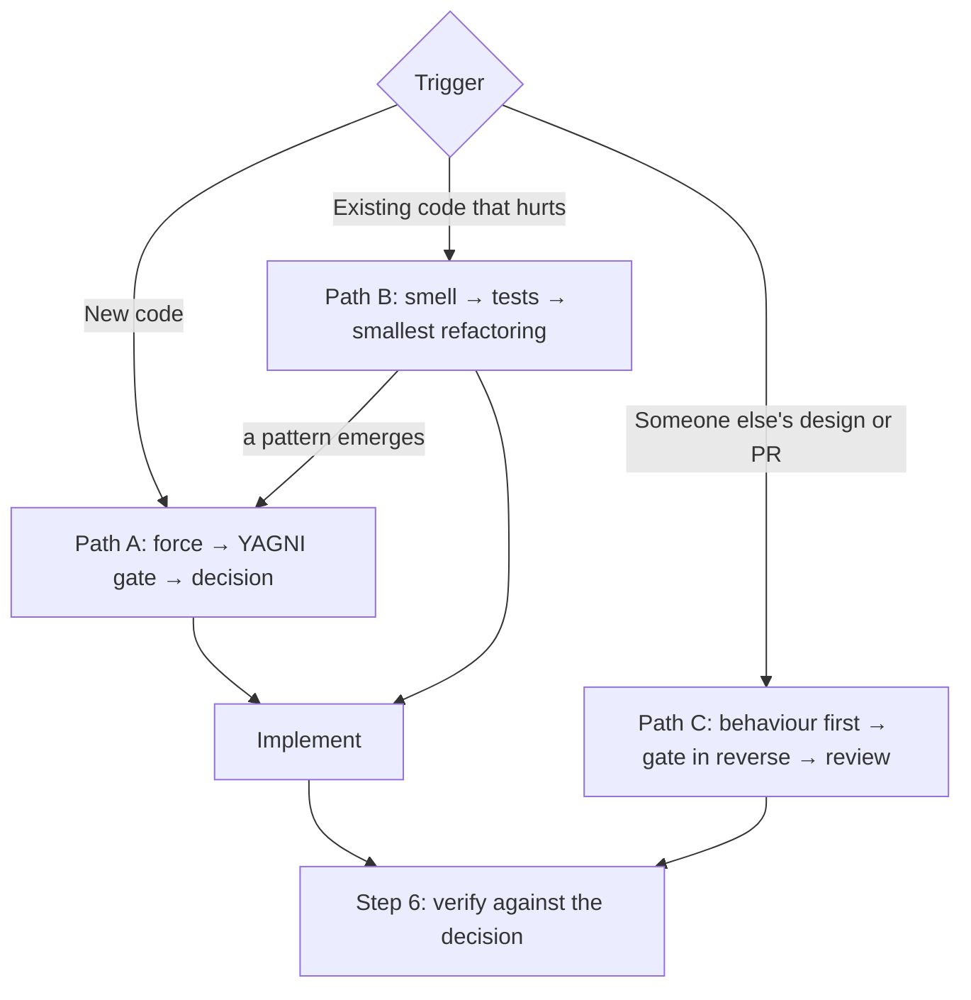

# Patterns & Refactoring

Three doors into this skill. Pick the one that matches the trigger. Every door ends at the
same place: **Step 6 — verify what you actually built.**

---

## Step 0 — Triage (every path)

Over-applying this skill is itself an anti-pattern. Be honest about the level.

| Level | Looks like | What you produce |
|---|---|---|
| **TRIVIAL** | One-line fix, copy change, config value, new field on an existing form, bug fix introducing no abstraction | **Nothing.** Skip this skill and write the code. |
| **STANDARD** | New service, endpoint, component, job, integration; a refactor across a handful of files | 2–4 lines before coding: *force or smell → choice made → alternative rejected and why* |
| **ARCHITECTURAL** | New module or bounded context, publishable package, cross-cutting refactor, a decision other code must live with | A **Pattern Decisions** section in the spec or plan, with a Mermaid diagram and the rejected alternatives |

Between two levels? Pick the lower. A missing paragraph is cheap; ceremony on every task gets
the whole process abandoned.

**Reviewers re-triage independently.** A PR labelled "just structure" frequently contains
behaviour. Triage what the diff *does*, not what its description says.

## Step 0.5 — Read the room (every path)

Two lookups before any decision, both cheap:

1. **Detect the stack** from the manifest — `composer.json`, `package.json`, `go.mod`,
   `Cargo.toml`, `pyproject.toml`, `Gemfile`, `*.csproj`, `pom.xml` / `build.gradle` — and
   open the matching file in [`references/idioms/`](references/idioms/). Do not guess the
   stack from file extensions.
2. **Find how this codebase already solves this kind of problem.** Grep for an existing
   `Actions/`, `Services/`, `Pipelines/`, event, job, or resolver that does something of the
   same shape. Follow it. Consistency with the codebase beats textbook purity: a second way of
   doing the same thing is a smell you are introducing. If the existing convention is itself a
   smell, say so in the decision rather than silently diverging from it. If there is no
   convention yet, say that too, and default to the framework idiom.

---

# Path A — New code: force before pattern

## The one rule

**Never start from the catalogue.** Browsing 22 patterns for one that fits guarantees a fit;
that is how a codebase acquires an `AbstractStrategyFactoryProvider` wrapping a single `if`.

Start from the problem. Every pattern answers exactly one question:

> **What is going to change here, and what must stay still while it changes?**

That is the *axis of change*, or *force*. Name it in plain words before naming any pattern. No
nameable force means no pattern — write the direct code.

## Step 1 — Name the force

1. **What varies?** Which part will have a second, third, fourth version?
2. **Who wants it to vary?** A requirement, a third-party API, a customer tier, a platform, a test double? "It might be nice" is not a source; a named source is.
3. **What must not move?** Which callers, contracts, or stored data must survive untouched?
4. **When does it vary?** Compile time, boot time, per request, per user, mid-flight? Runtime variation demands a different pattern from configuration-time variation.
5. **How many axes?** Two independent axes (abstraction *and* implementation) is a Bridge, not two Strategies bolted together.

Write it as a sentence: *"The payment provider varies per tenant, chosen at runtime, while the
checkout flow must not change."* That sentence usually names the pattern by itself.

**If nothing varies** — stop. The right design for a problem with one implementation is direct,
readable, deletable code. Go to Step 5 and write the NO-PATTERN decision.

## Step 2 — Route to a family

| What varies | Family | Read |
|---|---|---|
| Which concrete object is created, or how it is assembled | Creational | [gof-catalog.md](references/gof-catalog.md#creational-patterns) |
| How objects are composed, wrapped, or reached | Structural | [gof-catalog.md](references/gof-catalog.md#structural-patterns) |
| Which algorithm runs, who reacts, how work is dispatched | Behavioral | [gof-catalog.md](references/gof-catalog.md#behavioral-patterns) |
| Where data lives, how layers depend on each other | Architectural | [architectural.md](references/architectural.md) |
| How persistence, mapping, and the domain relate | Enterprise (PoEAA) | [enterprise-patterns.md](references/enterprise-patterns.md) |
| How the business domain is modelled and bounded | DDD | [ddd-patterns.md](references/ddd-patterns.md) |
| How services survive each other's failures | Distributed / cloud | [distributed-patterns.md](references/distributed-patterns.md) |
| How messages move between systems | Messaging / integration | [distributed-patterns.md](references/distributed-patterns.md#messaging-and-integration) |
| How work runs in parallel or asynchronously | Concurrency | [concurrency-patterns.md](references/concurrency-patterns.md) |
| How data is transformed and errors are carried | Functional | [functional-patterns.md](references/functional-patterns.md) |
| How UI components, state, and rendering are organised | Frontend | [frontend-patterns.md](references/frontend-patterns.md) |

### Fast routing from a stated force

| Force, in words | Start here |
|---|---|
| "Subclasses decide which object to make" | Factory Method |
| "Whole families of objects must stay consistent" | Abstract Factory |
| "Too many constructor arguments / step-by-step assembly" | Builder |
| "Cloning beats constructing" | Prototype |
| "Exactly one instance, globally reachable" | Singleton — read [antipatterns.md](references/antipatterns.md#singleton) first |
| "Two incompatible interfaces must talk" | Adapter |
| "Abstraction and implementation vary independently" | Bridge |
| "Treat one thing and a tree of things uniformly" | Composite |
| "Stack optional behaviour at runtime" | Decorator |
| "Hide a messy subsystem behind one door" | Facade |
| "Too many near-identical objects eat memory" | Flyweight |
| "Control or defer access to an object" | Proxy |
| "A request travels handlers until one takes it" | Chain of Responsibility |
| "Actions become first-class: queued, logged, undone" | Command |
| "Traverse without exposing structure" | Iterator |
| "Many-to-many chatter needs a hub" | Mediator |
| "Undo / snapshot without breaking encapsulation" | Memento |
| "Many things must react to one event" | Observer |
| "Behaviour changes wholesale with state" | State |
| "Interchangeable algorithms chosen at runtime" | Strategy |
| "Same skeleton, different steps" | Template Method |
| "New operations over a stable structure" | Visitor |
| "Persistence must be swappable / testable" | Repository |
| "One transaction, many changed objects" | Unit of Work |
| "Reads and writes have different shapes and loads" | CQRS |
| "History is a business requirement" | Event Sourcing |
| "The domain must not know about the framework" | Hexagonal / Ports & Adapters |
| "A request flows through ordered stages" | Pipes and Filters |
| "Business rules must be combined and reused" | Specification |
| "A failing dependency must not take us down" | Circuit Breaker + Retry + Timeout |
| "A transaction spans services" | Saga + Compensating Transaction |
| "Publish an event only if the write committed" | Transactional Outbox |
| "The same message may arrive twice" | Idempotent Receiver |
| "Replace a legacy system while it stays live" | Strangler Fig |
| "Another system's model must not leak into ours" | Anti-Corruption Layer |
| "An operation can fail in expected ways" | Result / Either — [functional-patterns.md](references/functional-patterns.md) |

State vs Strategy, Adapter vs Facade, Decorator vs Proxy, Strategy vs Template Method and
Bridge vs Strategy are the confusions that matter. `gof-catalog.md` disambiguates each pair.

**A catalogue "Use when" is not a "use now".** Strategy lists export formats as a classic fit;
that does not make an exporter interface right for a ticket with one format. The gate in Step 4
still applies to every textbook example.

## Step 3 — Check the framework and the codebase first

Most patterns already exist in your framework. Rebuilding one by hand is not "applying a
pattern", it is duplicating infrastructure you then have to maintain.

Read [framework-idioms.md](references/framework-idioms.md) before writing pattern scaffolding.
It routes to the per-stack file from Step 0.5 and carries a cross-stack table of where each
ecosystem hides the same pattern: Spring's `*Template` classes *are* Template Method, .NET's
`DbSet<T>` *is* a Repository, Laravel's `Pipeline` and Go's `http.Handler` wrapping *are*
Chain of Responsibility, Laravel's `Notification::via()` *is* the channel Strategy.

Then check the codebase's own idiom (Step 0.5). If it already resolves strategies, dispatches
events, or runs pipelines one way, use that way. Naming the pattern the framework or the
codebase implements is valuable; reimplementing it is not.

## Step 4 — The YAGNI gate

A pattern must pass **all four**. Any failure means write the direct code and revisit later.

1. **Rule of Three.** Do two variants exist *today*, with a third concretely foreseen? One implementation plus a hypothetical is a guess, not an axis of change.
2. **Named source of variation.** Point at the requirement, API, tenant, or platform forcing it. "For flexibility" is not a source.
3. **The cost is paid back.** Indirection costs files, names, and a longer path from symptom to cause when debugging. Does the variation buy that back?
4. **The direct version is genuinely worse.** Write the naive version in your head. If it is clear and easy to change later, it wins.

Full failure modes — speculative generality, Singleton as a disguised global, factories of
factories, pattern-name theatre — in [antipatterns.md](references/antipatterns.md).

**Refactoring into a pattern later is normal and cheap. Guessing wrong up front is neither.**

### When someone asks you to "make it extensible"

A tech lead, a PM, or a ticket asking for extensibility does not change the gate. It changes
what you say. Answer with the *seam*, not the abstraction:

1. **Separate what is stable from what would vary** — the query from the writer, the rule from the channel, the calculation from the format — as two plain functions or classes with no interface between them. The seam lives where the codebase already puts that kind of logic; with no convention, in the smallest scope that keeps it callable, usually a private method of the caller.
2. **Name the trigger for the abstraction:** "When the second format has a ticket, this becomes a Strategy; the seam is already where the interface would go."
3. **Explain why waiting is safer:** an interface designed from one case is the interface the second case cannot satisfy. Designing it from two real cases costs less than designing it twice.

That is extensibility delivered without paying for it today. A request for extensibility that
still fails the gate after this answer is the requester's call: ship the direct version, record
the offer in the decision as *rejected — the requester may override*, and add the abstraction
only when they do.

## Step 5 — State the decision

Templates for every level, with worked examples, are in
[decision-templates.md](references/decision-templates.md). The two you will use most:

**NO-PATTERN** — the most common and most valuable outcome. State it; do not skip it:

> **Force:** none today — one provider, one signature scheme. "Maybe Paddle next year" has no ticket.
> **Choice:** direct code. Header parsing and the HMAC check separated as two plain methods (the seam).
> **Becomes a pattern when:** a second provider has a ticket → Strategy over the verifier.

**STANDARD**, in the chat before writing code:

> **Force:** notification channels vary per user preference, chosen at runtime; the sending
> call site must not change.
> **Pattern:** Strategy, resolved through the container by channel key.
> **Rejected:** a `match` in the sender — three channels exist today and a fourth is on the
> roadmap, so the branch would keep growing at one call site.
> **Framework:** Laravel's notification channels already do this — extending `via()`, not a resolver.

**ARCHITECTURAL**: a `Pattern Decisions` section in the spec or plan, one entry per decision in
the ADR shape from `decision-templates.md`, with a Mermaid diagram of the structure.

Never write "used the Strategy pattern" and stop. The force and the rejected alternative are
what remain useful in six months; the name alone is decoration.

---

# Path B — Existing code: smell before cure

## The one rule

**Refactoring changes structure, never behaviour.** If behaviour changes, it is not a
refactoring — it is a rewrite, and it needs its own tests and its own review.

## Step 1 — Name the smell

Do not say "this code is messy". Name the specific smell: Long Method, Feature Envy, Shotgun
Surgery, Primitive Obsession, Divergent Change… The name carries the diagnosis *and* the cure.

All 22 smells, with symptoms, causes, and their treatments:
[code-smells.md](references/code-smells.md).

**Feature on messy code?** That is *preparatory refactoring*: make the change easy (Path B, own
commits), then make the easy change (Path A, own commit). Never both in one diff. Details in
[refactoring-workflow.md](references/refactoring-workflow.md#preparatory-refactoring).

## Step 2 — Cover it with tests first

Non-negotiable. Refactoring without a safety net is editing and hoping.

- Tests exist → **run them now**, show the result, and confirm they cover the target. "The suite is probably green" is not a result.
- Tests do not exist → write **characterization tests** first: capture what the code does *now*, bugs included. Do not fix behaviour in the same step.
- No test runner available (no `vendor/`, no `node_modules`) → a plain script that executes the pinned cases and exits non-zero on drift is a valid safety net. Keep the cases in a file the real runner can consume later.
- The code is untestable → that is the first refactoring. Break the dependency (extract an interface, introduce a seam), then test, then continue.
- A bug is discovered or reported alongside the refactor → **pin the buggy behaviour**, finish the refactoring, then fix the bug in its own commit and move the pinned expectation *in that commit*. If the correct behaviour is ambiguous, ask; when nobody can answer, fix only the unambiguous part, keep the rest pinned, make the fix the last and droppable checkpoint, and state the assumption in it.

Details in [refactoring-workflow.md](references/refactoring-workflow.md). Test shapes per
situation in [testing-patterns.md](references/testing-patterns.md).

### Under deadline pressure

The two rules — *tests are non-negotiable* and *under acute deadline, note the debt and ship* —
resolve like this:

- If pinning the behaviour costs less than the refactoring itself (a pure function over data, a class with clear inputs and outputs): pin it and refactor. That is minutes, not hours.
- If pinning would cost more than the deadline allows: **do not refactor now.** Ship the feature with Sprout Method or Wrap Method, note the debt, schedule the refactor.
- There is no third option in which the code gets restructured without a net because someone said there was no time.

| Rationalization | Reality |
|---|---|
| "No time for tests" | Then there is no time to refactor. Sprout the new code and leave the old shape alone. |
| "It's a pure function, I can see it's equivalent" | Pure functions are the *cheapest* to pin. Fifteen cases, one generator, five minutes. |
| "I'll add tests after the refactor" | Tests written after pin the new behaviour, including whatever the refactor broke. |
| "The fix is tiny, I'll fold it into the extract" | A reviewer cannot separate the two, and a revert throws away the wrong half. |
| "The runner isn't installed, so tests aren't possible" | A plain script with the pinned cases is a runner. |

## Step 3 — Smallest refactoring first

Pick from the 66 catalogued techniques in
[refactoring-techniques.md](references/refactoring-techniques.md), grouped as:

| Group | For |
|---|---|
| Composing Methods | Methods that are too long or tangled |
| Moving Features Between Objects | Responsibilities living in the wrong class |
| Organizing Data | Primitives, magic numbers, exposed fields, type codes |
| Simplifying Conditional Expressions | Nested and duplicated branching |
| Simplifying Method Calls | Unclear, unsafe, or overloaded interfaces |
| Dealing with Generalization | Inheritance hierarchies that fit badly |

Work in **small, individually reversible steps**, running tests after each. A refactor that
cannot be abandoned halfway was too big. When a step goes red, revert it; do not debug it.

**Checkpoint granularity:** one checkpoint per named technique applied to one target —
"constants introduced", "pricing extracted", "guard clauses in `process()`". Not one per line,
not one for the whole refactor. Commit at each checkpoint when the user's workflow allows
commits; otherwise stop there, report the green run, and let the user commit.

Output before starting, at STANDARD level:

> **Smell:** Long Method (`process()`, 90 lines, five commented sections) + Magic Numbers.
> **Safety net:** no tests → characterization tests over 15 representative inputs, run green.
> **Sequence:** Replace Magic Number with Symbolic Constant → Extract Method per section → Guard Clauses.
> **Pattern deferred:** tiers want Replace Type Code with Strategy; one new tier next week is an `if`, not a hierarchy — YAGNI gate after the extractions land.

## Step 4 — Let the pattern emerge, don't force it

Most smells are cured by plain refactorings and no pattern at all. That is the common case,
not the exception.

When a pattern *does* emerge — a type code that wants to be State/Strategy, a conditional that
wants polymorphism, a god class that wants to split — take it back through **Path A Step 4**,
the YAGNI gate. A pattern reached by refactoring still has to justify its cost.

---

# Path C — Reviewing someone else's design

For a pull request, a proposed design, or a plan that adds structure. The skill's own gate,
run in reverse, per abstraction.

## Step 1 — Behaviour first

Read the diff for what it *does* before what it *is*. Swallowed exceptions, null paths, missing
bindings, loose comparisons on magic values — these outrank every design point and go first in
the review. This skill covers the design half; it does not excuse skipping the behaviour half.

## Step 2 — Run the gate backwards on each added abstraction

For every interface, base class, factory, wrapper, DTO, event, or layer the change introduces:

1. Can the author name the force? Is the source of variation real and named, or "so we can swap it later"?
2. Do two variants exist today? Count implementations. One is a guess.
3. Does the framework or the codebase already provide it? ([framework-idioms.md](references/framework-idioms.md), Step 0.5)
4. Is the direct version genuinely worse? Sketch it. If it is smaller and as clear, say so with the sketch.
5. Does it make the code easier to test, or harder?

For every changed piece of existing code: name the smell it cures or introduces, by name, from
[code-smells.md](references/code-smells.md). Check
[antipatterns.md](references/antipatterns.md) for the named shape before writing your own
description of it. The stack is known, so go straight to its file in
[`references/idioms/`](references/idioms/) for the framework check.

## Step 3 — Write the review

Shape, in this order — full template in
[decision-templates.md](references/decision-templates.md#review):

1. **Verdict** in one line: approve, approve with nits, or request changes — plus the re-triage when the diff does more than its description says.
2. **Blocking behaviour** — each with file and line, what fails, and the fix. Missing or insufficient tests are a blocking item, not a nit.
3. **Design** — one section per abstraction the author justified, quoting their justification and answering it with the gate. Name the anti-pattern or smell.
4. **The direct alternative** — a sketch, sized in files and lines, with any public-contract change it implies and the variant that avoids it. Removing an abstraction is a request that must come with the smaller shape, or it is just criticism.
5. **Nits** — clearly labelled, never mixed with blocking items.

Then run Step 6 on the alternative you proposed, not on the author's code. A verdict has no
time budget: when the author is under deadline pressure, offer the smaller direct version —
usually faster to land than the abstraction — rather than a conditional approve. Removing an
abstraction after callers adapt to it costs more than never adding it. Length follows the
number of distinct findings, not the diff's line count.

---

## Step 6 — Verify what you built (every path)

The decision was made before the code. Now check the code against it — this is where
abstractions creep in unannounced. Full checklist in
[verification.md](references/verification.md); the short form:

- [ ] **Every new interface or abstract class has two implementations in this change**, or is named in the decision as a deliberate seam with its trigger.
- [ ] **No generic component with one consumer** — a "reusable" writer, mapper or helper used from one place is inlined until the second consumer exists.
- [ ] **Every new class is named for a domain concept**, not a mechanism (`PricingRule`, not `PricingStrategyFactoryImpl`).
- [ ] **The rejected alternative did not sneak back in** — no `match` beside the Strategy, no wrapper beside the framework feature the decision chose.
- [ ] **Tests exercise the axis of change** — one test per variant, wrapping order, listener plus wiring, or the pinned cases still green — and **they ran**. No runner installed → say so and show the lint or type check; never report tests as passing without a run.
- [ ] **File count matches the level** — a STANDARD decision that produced eight files is over-engineering or an undeclared ARCHITECTURAL one.
- [ ] **The direct version, re-sketched now, is still worse.** If not, simplify before reporting done.

Report the audit in the three-line shape from `decision-templates.md`, including "nothing to
change". An audit that only ever says "all good" is not being run.

---

## Reference index

Load only what you need. `SKILL.md` routes; the references carry the depth.

| File | Use when |
|---|---|
| [decision-templates.md](references/decision-templates.md) | You are writing the decision, the ADR, or the review, and want the shape and a worked example |
| [verification.md](references/verification.md) | The code is written and you are auditing it against the decision |
| [gof-catalog.md](references/gof-catalog.md) | You have a family and need the pattern, its cost, and when *not* to use it |
| [architectural.md](references/architectural.md) | The decision is about layering, boundaries, or deployment topology |
| [enterprise-patterns.md](references/enterprise-patterns.md) | Persistence, ORM mapping, domain logic organisation, session and locking |
| [ddd-patterns.md](references/ddd-patterns.md) | Modelling a complex business domain, or drawing context boundaries |
| [distributed-patterns.md](references/distributed-patterns.md) | Services, queues, retries, consistency, integration |
| [concurrency-patterns.md](references/concurrency-patterns.md) | Parallelism, async work, shared mutable state |
| [functional-patterns.md](references/functional-patterns.md) | Data transformation, error handling without exceptions, composition |
| [frontend-patterns.md](references/frontend-patterns.md) | Components, client state, rendering, data fetching |
| [code-smells.md](references/code-smells.md) | Existing code hurts and you need to name why |
| [refactoring-techniques.md](references/refactoring-techniques.md) | You know the smell and need the mechanical cure |
| [refactoring-workflow.md](references/refactoring-workflow.md) | Refactoring safely: seams, characterization tests, expand/contract, Branch by Abstraction, legacy work |
| [testing-patterns.md](references/testing-patterns.md) | Which tests a pattern or a refactor needs; doubles, contract tests, approval tests, test smells |
| [antipatterns.md](references/antipatterns.md) | You are about to add indirection and want the gate applied honestly |
| [framework-idioms.md](references/framework-idioms.md) | **Before hand-rolling any pattern.** Routes to one of 10 per-stack files in [`references/idioms/`](references/idioms/) |

---

## Where this fits in the work

Self-contained; no dependency on any other skill, plugin or tool. It occupies one slot:
**after you know what to build, before you write how it is built, and again after it is
built.**

- **Requirements come first.** This skill never decides *what* to build. Arrive with the requirement settled.
- **Debugging comes first.** Find the root cause before touching structure. Never paper over a bug with a pattern.
- **Tests come alongside.** Path A: a pattern that makes code *harder* to test is probably wrong. Path B: tests are a precondition, not a follow-up.

If your workflow already has planning, TDD or code-review steps, this slots between them
without needing to know they exist.

---

## Attribution

Pattern, smell and refactoring taxonomies follow [refactoring.guru](https://refactoring.guru)
by Alexander Shvets, building on *Design Patterns* (Gamma, Helm, Johnson & Vlissides, 1994) and
Martin Fowler's *Refactoring*. Further catalogues credited in each reference file. All text
here is original; for illustrated explanations and full PHP examples, go to the source:
<https://refactoring.guru/design-patterns/php>.
