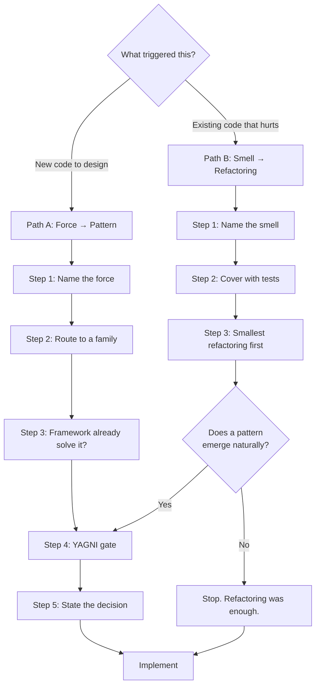

# Patterns & Refactoring

Two doors into this skill. Pick the one that matches the trigger.

---

## Step 0 — Triage (both paths)

Over-applying this skill is itself an anti-pattern. Be honest about the level.

| Level | Looks like | What you produce |
|---|---|---|
| **TRIVIAL** | One-line fix, copy change, config value, new field on an existing form, bug fix introducing no abstraction | **Nothing.** Skip this skill and write the code. |
| **STANDARD** | New service, endpoint, component, job, integration; a refactor across a handful of files | 2–4 lines before coding: *force or smell → choice made → alternative rejected and why* |
| **ARCHITECTURAL** | New module or bounded context, publishable package, cross-cutting refactor, a decision other code must live with | A **Pattern Decisions** section in the spec or plan, with a Mermaid diagram and the rejected alternatives |

Between two levels? Pick the lower. A missing paragraph is cheap; ceremony on every task gets
the whole process abandoned.

---

# Path A — New code: force before pattern

## The one rule

**Never start from the catalogue.** Browsing 22 patterns for one that fits guarantees a fit;
that is how a codebase acquires an `AbstractStrategyFactoryProvider` wrapping a single `if`.

Start from the problem. Every pattern answers exactly one question:

> **What is going to change here, and what must stay still while it changes?**

That is the *axis of change*, or *force*. Name it in plain words before naming any pattern. No
nameable force means no pattern — write the direct code.

## Step 1 — Name the force

1. **What varies?** Which part will have a second, third, fourth version?
2. **Who wants it to vary?** A requirement, a third-party API, a customer tier, a platform, a test double? "It might be nice" is not a source; a named source is.
3. **What must not move?** Which callers, contracts, or stored data must survive untouched?
4. **When does it vary?** Compile time, boot time, per request, per user, mid-flight? Runtime variation demands a different pattern from configuration-time variation.
5. **How many axes?** Two independent axes (abstraction *and* implementation) is a Bridge, not two Strategies bolted together.

Write it as a sentence: *"The payment provider varies per tenant, chosen at runtime, while the
checkout flow must not change."* That sentence usually names the pattern by itself.

**If nothing varies** — stop. The right design for a problem with one implementation is direct,
readable, deletable code.

## Step 2 — Route to a family

| What varies | Family | Read |
|---|---|---|
| Which concrete object is created, or how it is assembled | Creational | [gof-catalog.md](references/gof-catalog.md#creational-patterns) |
| How objects are composed, wrapped, or reached | Structural | [gof-catalog.md](references/gof-catalog.md#structural-patterns) |
| Which algorithm runs, who reacts, how work is dispatched | Behavioral | [gof-catalog.md](references/gof-catalog.md#behavioral-patterns) |
| Where data lives, how layers depend on each other | Architectural | [architectural.md](references/architectural.md) |
| How persistence, mapping, and the domain relate | Enterprise (PoEAA) | [enterprise-patterns.md](references/enterprise-patterns.md) |
| How the business domain is modelled and bounded | DDD | [ddd-patterns.md](references/ddd-patterns.md) |
| How services survive each other's failures | Distributed / cloud | [distributed-patterns.md](references/distributed-patterns.md) |
| How messages move between systems | Messaging / integration | [distributed-patterns.md](references/distributed-patterns.md#messaging-and-integration) |
| How work runs in parallel or asynchronously | Concurrency | [concurrency-patterns.md](references/concurrency-patterns.md) |
| How data is transformed and errors are carried | Functional | [functional-patterns.md](references/functional-patterns.md) |
| How UI components, state, and rendering are organised | Frontend | [frontend-patterns.md](references/frontend-patterns.md) |

### Fast routing from a stated force

| Force, in words | Start here |
|---|---|
| "Subclasses decide which object to make" | Factory Method |
| "Whole families of objects must stay consistent" | Abstract Factory |
| "Too many constructor arguments / step-by-step assembly" | Builder |
| "Cloning beats constructing" | Prototype |
| "Exactly one instance, globally reachable" | Singleton — read [antipatterns.md](references/antipatterns.md#singleton) first |
| "Two incompatible interfaces must talk" | Adapter |
| "Abstraction and implementation vary independently" | Bridge |
| "Treat one thing and a tree of things uniformly" | Composite |
| "Stack optional behaviour at runtime" | Decorator |
| "Hide a messy subsystem behind one door" | Facade |
| "Too many near-identical objects eat memory" | Flyweight |
| "Control or defer access to an object" | Proxy |
| "A request travels handlers until one takes it" | Chain of Responsibility |
| "Actions become first-class: queued, logged, undone" | Command |
| "Traverse without exposing structure" | Iterator |
| "Many-to-many chatter needs a hub" | Mediator |
| "Undo / snapshot without breaking encapsulation" | Memento |
| "Many things must react to one event" | Observer |
| "Behaviour changes wholesale with state" | State |
| "Interchangeable algorithms chosen at runtime" | Strategy |
| "Same skeleton, different steps" | Template Method |
| "New operations over a stable structure" | Visitor |
| "Persistence must be swappable / testable" | Repository |
| "One transaction, many changed objects" | Unit of Work |
| "Reads and writes have different shapes and loads" | CQRS |
| "History is a business requirement" | Event Sourcing |
| "The domain must not know about the framework" | Hexagonal / Ports & Adapters |
| "A request flows through ordered stages" | Pipes and Filters |
| "Business rules must be combined and reused" | Specification |
| "A failing dependency must not take us down" | Circuit Breaker + Retry + Timeout |
| "A transaction spans services" | Saga + Compensating Transaction |
| "Publish an event only if the write committed" | Transactional Outbox |
| "The same message may arrive twice" | Idempotent Receiver |
| "Replace a legacy system while it stays live" | Strangler Fig |
| "Another system's model must not leak into ours" | Anti-Corruption Layer |
| "An operation can fail in expected ways" | Result / Either — [functional-patterns.md](references/functional-patterns.md) |

State vs Strategy, Adapter vs Facade, Decorator vs Proxy, Strategy vs Template Method and
Bridge vs Strategy are the confusions that matter. `gof-catalog.md` disambiguates each pair.

## Step 3 — Check the framework first

Most patterns already exist in your framework. Rebuilding one by hand is not "applying a
pattern", it is duplicating infrastructure you then have to maintain.

Read [framework-idioms.md](references/framework-idioms.md) before writing pattern scaffolding.
Laravel's service container *is* Abstract Factory + DI; its `Pipeline` *is* Chain of
Responsibility; Eloquent *is* Active Record, which is why layering Repository on top of it is
a decision needing justification rather than a default; Vue reactivity and Livewire events
*are* Observer.

Naming the pattern the framework implements is valuable — it tells the reader why the code is
shaped that way. Reimplementing it is not.

## Step 4 — The YAGNI gate

A pattern must pass **all four**. Any failure means write the direct code and revisit later.

1. **Rule of Three.** Do two variants exist *today*, with a third concretely foreseen? One implementation plus a hypothetical is a guess, not an axis of change.
2. **Named source of variation.** Point at the requirement, API, tenant, or platform forcing it. "For flexibility" is not a source.
3. **The cost is paid back.** Indirection costs files, names, and a longer path from symptom to cause when debugging. Does the variation buy that back?
4. **The direct version is genuinely worse.** Write the naive version in your head. If it is clear and easy to change later, it wins.

Full failure modes — speculative generality, Singleton as a disguised global, factories of
factories, pattern-name theatre — in [antipatterns.md](references/antipatterns.md).

**Refactoring into a pattern later is normal and cheap. Guessing wrong up front is neither.**

## Step 5 — State the decision

**STANDARD**, in the chat before writing code:

> **Force:** notification channels vary per user preference, chosen at runtime; the sending
> call site must not change.
> **Pattern:** Strategy, resolved through the container by channel key.
> **Rejected:** a `match` in the sender — three channels exist today and a fourth is on the
> roadmap, so the branch would keep growing at one call site.

**ARCHITECTURAL**: a `Pattern Decisions` section in the spec or plan, one entry per decision,
each with force, pattern, rejected alternatives, and a Mermaid diagram of the structure.

Never write "used the Strategy pattern" and stop. The force and the rejected alternative are
what remain useful in six months; the name alone is decoration.

---

# Path B — Existing code: smell before cure

## The one rule

**Refactoring changes structure, never behaviour.** If behaviour changes, it is not a
refactoring — it is a rewrite, and it needs its own tests and its own review.

## Step 1 — Name the smell

Do not say "this code is messy". Name the specific smell: Long Method, Feature Envy, Shotgun
Surgery, Primitive Obsession, Divergent Change… The name carries the diagnosis *and* the cure.

All 22 smells, with symptoms, causes, and their treatments:
[code-smells.md](references/code-smells.md).

## Step 2 — Cover it with tests first

Non-negotiable. Refactoring without a safety net is editing and hoping.

- Tests exist → run them, confirm green, and confirm they actually cover the target.
- Tests do not exist → write **characterization tests** first: capture what the code does *now*, bugs included. Do not fix behaviour in the same step.
- The code is untestable → that is the first refactoring. Break the dependency (extract an interface, introduce a seam), then test, then continue.

Details in [refactoring-workflow.md](references/refactoring-workflow.md).

## Step 3 — Smallest refactoring first

Pick from the 66 catalogued techniques in
[refactoring-techniques.md](references/refactoring-techniques.md), grouped as:

| Group | For |
|---|---|
| Composing Methods | Methods that are too long or tangled |
| Moving Features Between Objects | Responsibilities living in the wrong class |
| Organizing Data | Primitives, magic numbers, exposed fields, type codes |
| Simplifying Conditional Expressions | Nested and duplicated branching |
| Simplifying Method Calls | Unclear, unsafe, or overloaded interfaces |
| Dealing with Generalization | Inheritance hierarchies that fit badly |

Work in **small, individually reversible steps**, running tests after each. Commit at every
green point. A refactor that cannot be abandoned halfway was too big.

## Step 4 — Let the pattern emerge, don't force it

Most smells are cured by plain refactorings and no pattern at all. That is the common case,
not the exception.

When a pattern *does* emerge — a type code that wants to be State/Strategy, a conditional that
wants polymorphism, a god class that wants to split — take it back through **Path A Step 4**,
the YAGNI gate. A pattern reached by refactoring still has to justify its cost.

---

## Reference index

Load only what you need. `SKILL.md` routes; the references carry the depth.

| File | Use when |
|---|---|
| [gof-catalog.md](references/gof-catalog.md) | You have a family and need the pattern, its cost, and when *not* to use it |
| [architectural.md](references/architectural.md) | The decision is about layering, boundaries, or deployment topology |
| [enterprise-patterns.md](references/enterprise-patterns.md) | Persistence, ORM mapping, domain logic organisation, session and locking |
| [ddd-patterns.md](references/ddd-patterns.md) | Modelling a complex business domain, or drawing context boundaries |
| [distributed-patterns.md](references/distributed-patterns.md) | Services, queues, retries, consistency, integration |
| [concurrency-patterns.md](references/concurrency-patterns.md) | Parallelism, async work, shared mutable state |
| [functional-patterns.md](references/functional-patterns.md) | Data transformation, error handling without exceptions, composition |
| [frontend-patterns.md](references/frontend-patterns.md) | Components, client state, rendering, data fetching |
| [code-smells.md](references/code-smells.md) | Existing code hurts and you need to name why |
| [refactoring-techniques.md](references/refactoring-techniques.md) | You know the smell and need the mechanical cure |
| [refactoring-workflow.md](references/refactoring-workflow.md) | Refactoring safely: seams, characterization tests, large legacy work |
| [antipatterns.md](references/antipatterns.md) | You are about to add indirection and want the gate applied honestly |
| [framework-idioms.md](references/framework-idioms.md) | Before hand-rolling any pattern in Laravel, Vue, or TypeScript |

---

## Where this fits in the work

This skill is self-contained and has no dependencies on any other skill, plugin, or tool.

It occupies one specific slot: **after you know what to build, before you write how it is
built.** Three boundaries keep it in that slot:

- **Requirements come first.** This skill never decides *what* to build or whether a feature is worth building. Arrive with the requirement already settled.
- **Debugging comes first.** When something is broken, find the root cause before touching structure. Never reach for a pattern to paper over a bug, and never fix behaviour and refactor in the same commit.
- **Tests come alongside.** Path A: if a pattern makes something *harder* to test, that is strong evidence the pattern is wrong. Path B: tests are a precondition, not a follow-up.

If your workflow already includes planning or TDD steps of its own, this slots between them
without needing to know they exist.

---

## Attribution

Pattern, smell and refactoring taxonomies follow [refactoring.guru](https://refactoring.guru)
by Alexander Shvets, building on *Design Patterns* (Gamma, Helm, Johnson & Vlissides, 1994) and
Martin Fowler's *Refactoring*. Further catalogues credited in each reference file. All text
here is original; for illustrated explanations and full PHP examples, go to the source:
<https://refactoring.guru/design-patterns/php>.
