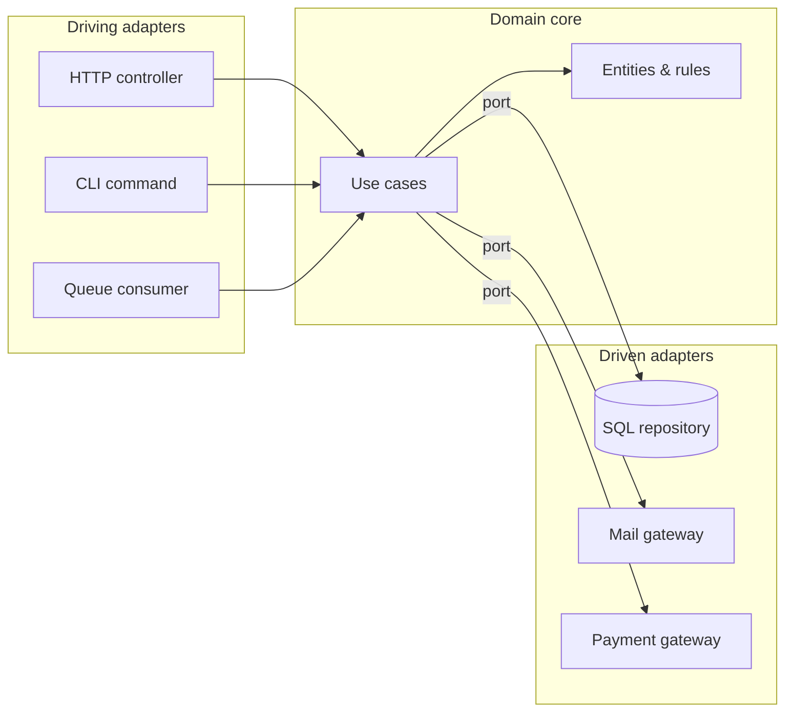

# Architectural patterns

GoF patterns shape classes. These shape *systems*: where the boundaries are, what depends on
what, and which decisions become expensive to reverse.

**The force here is different.** Class-level patterns absorb variation in behaviour.
Architectural patterns absorb variation in **dependency direction, deployment, and data flow**.
They are also the patterns you cannot cheaply refactor away later, so the YAGNI gate matters
most here.

---

## Layering and dependency direction

### Layered (N-tier)

- **Structure** — Presentation → Application → Domain → Infrastructure. Each layer depends only downward.
- **Use when** — The default for most applications. Well understood, and every framework assumes it.
- **Fails when** — The domain layer imports the ORM, the framework, or HTTP concerns. At that point the layering is decorative: it constrains your file tree but not your dependencies.
- **Cost** — Low. This is the baseline, not an achievement.

### Hexagonal / Ports & Adapters

- **Intent** — The domain defines *ports* (interfaces it needs); the outside world supplies *adapters*. All dependencies point inward.
- **Force** — Infrastructure varies or must be substitutable, and the domain must not know about it.
- **Use when** — The business logic outlives the delivery mechanism; multiple entry points (HTTP, CLI, queue, MCP) drive the same use cases; the domain must be testable with no database.
- **Do NOT use when** — The application *is* CRUD over a database. Hexagonal around a CRUD app is a folder structure with extra interfaces.
- **Cost** — Every infrastructure call gets an interface and a mapper. Real cost, real payoff — but only when substitution or isolation is genuinely needed.

### Clean Architecture / Onion

- **Relationship** — The same dependency-inversion idea as Hexagonal, with prescribed concentric rings (Entities → Use Cases → Interface Adapters → Frameworks) and an explicit *Dependency Rule*: source-code dependencies point only inward.
- **Use when** — Same conditions as Hexagonal, plus you want the ring vocabulary as a team convention.
- **Watch for** — Ring-counting as an end in itself. The Dependency Rule is the substance; the diagram is not.

### Modular Monolith

- **Intent** — One deployable, with hard internal module boundaries: each module owns its data and exposes a narrow public API.
- **Use when** — Almost always, before microservices. You get bounded contexts and independent reasoning without distributed-systems tax.
- **Enforce it** — Boundaries must be checked, not just intended: static analysis on namespace imports, no cross-module foreign keys, module-to-module calls through a published interface only.
- **Cost** — Discipline. Nothing stops a developer from importing across the boundary unless tooling does.

---

## Presentation architectures

| Pattern | Data flow | Use when |
|---|---|---|
| **MVC** | Controller handles input → updates Model → View renders | Server-rendered apps; the default in Laravel, Rails, Django |
| **MVP** | View delegates everything to a Presenter that holds no framework types | Desktop/legacy UI where the view is hard to test |
| **MVVM** | View binds declaratively to a ViewModel; changes propagate both ways | Data-binding frameworks (WPF, Android, Vue with a store) |
| **MVU / Elm** | State → View → Message → Update → new State, unidirectional | Predictable state, time-travel debugging (Redux, Elm, SwiftUI) |
| **Page Controller** | One controller per page/action | Small apps, invokable single-action controllers |
| **Front Controller** | One entry point routes everything | Every modern framework's `index.php` / router |

**Choosing:** if state changes flow one way and you want them replayable, MVU. If your framework
gives you two-way binding, MVVM. Otherwise MVC and stop thinking about it.

---

## Read/write and data-flow separation

### CQRS (Command Query Responsibility Segregation)

- **Intent** — Separate the model used to *change* data from the model used to *read* it.
- **Force** — Reads and writes have genuinely divergent shapes, loads, or consistency needs.
- **Use when** — Reads vastly outnumber writes and need denormalised projections; write-side invariants are complex; read models must be shaped per view.
- **Do NOT use when** — Reads and writes are the same shape. Then it is two folders holding one model.
- **Levels** — Note that CQRS is a spectrum: (1) separate methods, (2) separate models over one database, (3) separate read/write databases with projections. Most teams only ever need level 1 or 2. Level 3 brings eventual consistency into your UX and is a product decision, not just a technical one.
- **Cost** — At level 3, the read model lags. Every screen must tolerate stale data.

### Event Sourcing

- **Intent** — Store the sequence of state-changing events as the source of truth; current state is a fold over them.
- **Force** — History *is* the requirement: audit, temporal queries, "how did it get this way", replay into new projections.
- **Use when** — Finance, compliance, medical records, anything where "what changed and when" is a business question rather than a debugging convenience.
- **Do NOT use when** — You want an audit log. An append-only audit table gives you 90% of the value for 5% of the cost.
- **Cost** — The highest of any pattern here. Event schema versioning is forever; deletes fight GDPR (crypto-shredding is the usual mitigation); tooling and querying are entirely on you. Adopt deliberately or not at all.

### Pipes and Filters

- **Intent** — Decompose processing into independent stages connected by a uniform data contract.
- **Use when** — ETL, media processing, import pipelines, HTTP middleware, validation chains.
- **Related** — Chain of Responsibility at class level; Laravel's `Pipeline`; Unix pipes.
- **Cost** — Debugging is harder when a value is wrong three stages down. Make each stage pure and independently testable and this is cheap.

---

## Extension and evolution

### Microkernel / Plugin

- **Intent** — A minimal core plus plugins registering against extension points.
- **Use when** — Third parties or other teams must extend behaviour without touching the core: CMS plugins, IDE extensions, page-builder block types, payment provider add-ons.
- **Cost** — The extension API is a public contract from day one. Getting it wrong is expensive; version it deliberately.

### Strangler Fig

- **Intent** — Replace a legacy system incrementally by routing slices of traffic to the new implementation until nothing is left of the old.
- **Use when** — Any rewrite of a system that must stay live. The alternative — big-bang rewrite — is the single most reliable way to fail.
- **How** — Put a facade/router in front, migrate one capability at a time, keep both running, delete the old path only once traffic is zero.
- **Cost** — Two systems and a router to maintain during the transition, plus data synchronisation between them.

### Anti-Corruption Layer

- **Intent** — A translation layer that stops another system's model from leaking into yours.
- **Use when** — Integrating a legacy system, a badly-modelled third-party API, or another team's bounded context.
- **Related** — Adapter at class level; the ACL is its architectural counterpart, usually a package with its own DTOs and mappers.
- **Cost** — Duplicate models and mapping code. Worth it precisely when the foreign model is bad.

---

## Distribution topologies

| Pattern | Intent | Adopt when |
|---|---|---|
| **Microservices** | Independently deployable services around business capabilities | Teams need independent deploy cadence *and* you can pay for distributed tracing, versioning, and eventual consistency |
| **SOA** | Coarse services sharing an integration layer / ESB | Legacy enterprise integration; largely superseded |
| **Service-Based** | A few coarse services on a shared database | Middle ground: deployment independence without data-splitting pain |
| **Event-Driven** | Components communicate by publishing/consuming events | Loose coupling and independent scaling matter more than traceable flow |
| **Space-Based** | Replicated in-memory data grid, no central database bottleneck | Extreme, spiky concurrency (ticketing, trading) |
| **Serverless** | Functions per event, no managed runtime | Spiky or low-volume workloads, glue code, scheduled jobs |
| **BFF (Backends for Frontends)** | One tailored backend per client type | Web, mobile, and partner clients need genuinely different payloads |

**The honest default:** modular monolith. Microservices solve an *organisational* problem —
independent team deployment. If you have one team, they mostly add latency, failure modes, and
operational cost. Split when a boundary is proven stable, not while you are discovering it.

---

## Multi-tenancy

Not usually catalogued as a pattern, but it is an architectural decision with the same
irreversibility profile.

| Strategy | Isolation | Cost | Fits |
|---|---|---|---|
| Shared schema + `tenant_id` | Weakest — one missing scope leaks data | Cheapest to run | Many small tenants, low regulatory pressure |
| Schema per tenant | Medium | Migration fan-out | Mid-size tenant counts |
| Database per tenant | Strongest | Highest ops cost, N migrations | Few large tenants, health/finance data, per-tenant backup and residency |

The choice is driven by regulation and blast radius, not by elegance. Handling sensitive
personal data pushes hard toward database-per-tenant; a high tenant count pushes hard away
from it. Decide before the first migration — this is the single hardest thing on this page to
change later.

---

## Choosing: the reversibility test

Rank candidate architectural decisions by how expensive they are to undo:

1. **Cheap to reverse** — Layer order, folder structure, where a service lives. Decide fast, move on.
2. **Moderate** — Repository vs. direct ORM, CQRS levels 1–2, module boundaries. Decide with evidence, revisit at milestones.
3. **Expensive** — Event Sourcing, microservice split, multi-tenancy strategy, public plugin API. Requires a written decision with rejected alternatives, and ideally a spike.

Spend design effort in proportion to reversibility, not to how interesting the decision is.

---

## Sources

Martin Fowler, *Patterns of Enterprise Application Architecture* — <https://martinfowler.com/eaaCatalog/>
(catalogued in [enterprise-patterns.md](enterprise-patterns.md)) · Alistair Cockburn,
*Hexagonal Architecture* · Robert C. Martin, *Clean Architecture* · Mark Richards & Neal Ford,
*Software Architecture Patterns* · Microsoft, *Cloud Design Patterns* —
<https://learn.microsoft.com/azure/architecture/patterns/> (catalogued in
[distributed-patterns.md](distributed-patterns.md)).
