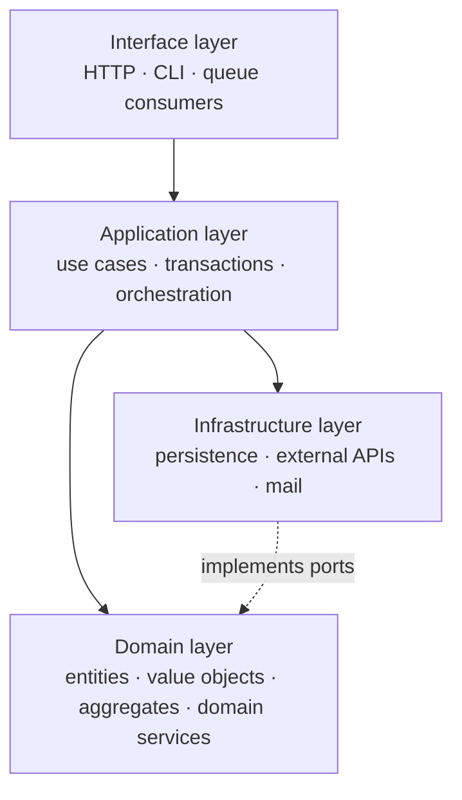

# Domain-Driven Design patterns

DDD is not a pattern catalogue with an entry fee. Its *tactical* patterns (Entity, Value
Object, Aggregate) are cheap and useful almost anywhere. Its *strategic* patterns (Bounded
Context, Context Mapping) are the expensive, high-leverage part, and they are about
organisational boundaries as much as code.

**Apply DDD when the domain is genuinely complex** — when experts argue about the rules, when
the rules interact, when getting them wrong is costly. For CRUD, DDD is ceremony. Eric Evans
said this himself: reserve the full method for the *core domain*, and use simpler approaches
everywhere else.

---

## Strategic patterns

These decide where your modules and services split. They are worth more than everything else on
this page combined.

### Ubiquitous Language

- **Idea** — One language shared by domain experts and code. If experts say "policy lapsed", the class is `Policy` with a `lapse()` method, not `PolicyStatusUpdateService::setStatus(4)`.
- **In practice** — When you catch yourself translating between what the business says and what the code says, that translation is a bug factory. Rename the code.
- **Cost** — Almost none. This is the highest value-to-cost item in all of DDD.

### Bounded Context

- **Idea** — An explicit boundary within which one model applies consistently. "Customer" in Billing is not "Customer" in Support, and forcing one shared class serves neither.
- **Why it matters** — The universal enterprise-model attempt is the classic failure: a `User` class with 60 fields because five departments needed different things. Bounded contexts let each have the model it needs.
- **In practice** — A bounded context is usually a module in a modular monolith, or a service in a distributed system. Its boundary is where translation happens.
- **Cost** — Duplicated concepts across contexts, deliberately. That duplication is the *point*, not a failure to DRY.

### Context Mapping

How two contexts relate. Naming the relationship makes the coupling visible and negotiable.

| Relationship | Meaning | When |
|---|---|---|
| **Shared Kernel** | Two contexts share a small common model | Same team, high coordination, small overlap |
| **Customer / Supplier** | Downstream has a say in upstream's roadmap | Both teams in the same organisation |
| **Conformist** | Downstream simply accepts the upstream model | No leverage over the upstream, translation not worth it |
| **Anti-Corruption Layer** | Downstream translates at the boundary | Upstream's model is bad or unstable and must not leak in |
| **Open Host Service** | Upstream publishes a general protocol for many consumers | Many downstreams |
| **Published Language** | A well-documented shared interchange format | Cross-organisation integration |
| **Separate Ways** | No integration at all | Integration costs more than duplication |

**Anti-Corruption Layer is the one you will use most.** Any legacy system, any third-party API
with a model you dislike, any team whose abstractions you cannot influence. Adapter at class
level; a package with its own DTOs and mappers at system level.

**Separate Ways is underused.** Sometimes two integrations that "should" share are cheaper
duplicated. Naming this as a deliberate choice beats drifting into it.

### Core / Supporting / Generic subdomains

- **Core** — What differentiates the business. Where DDD effort, the best people, and custom code belong.
- **Supporting** — Necessary, not differentiating. Build simply — Transaction Script is fine.
- **Generic** — Solved problems: auth, billing, notifications, PDF generation. **Buy, do not build.** Every hour spent lovingly modelling a generic subdomain is an hour stolen from the core.

Getting this triage wrong is the most expensive mistake in the list — it usually shows up as a
beautifully modelled invoicing engine inside a company whose actual advantage is somewhere else
entirely.

---

## Tactical patterns

### Entity

- **Definition** — Identity persists through change. Two orders with identical fields are still different orders; an order whose every field changed is still the same order.
- **Test** — Does it have an ID that matters? Would you track it over time?
- **Implication** — Equality by identifier, never by field values.

### Value Object

- **Definition** — Defined entirely by its attributes. No identity, immutable, freely replaceable. `Money`, `Email`, `DateRange`, `Address`, `Coordinates`.
- **Why it matters most** — Validation happens once at construction, so an `Email` that exists is valid everywhere. Behaviour has a home (`Money::add()` refusing mismatched currencies). The type system prevents whole bug classes.
- **Rule** — Prefer value objects over entities. Fewer identities means less state to track, and immutability removes a large category of bugs. Most Primitive Obsession is a missing value object.

### Aggregate & Aggregate Root

- **Definition** — A cluster of objects treated as one unit for data changes, with one *root* as the only external entry point. `Order` is the root; `OrderLine` is reachable only through it.
- **Rules** — External references point only to the root; invariants inside the boundary are always consistent; one transaction changes one aggregate; references between aggregates are by *ID*, not by object.
- **Why** — The aggregate boundary is your transaction boundary, your locking boundary, and later your service boundary. Getting it right early makes everything downstream easier.
- **Sizing** — Keep aggregates small. The common mistake is a huge aggregate (`Customer` containing every order ever) that becomes a contention point and a performance problem. When in doubt, split and reference by ID.

### Domain Event

- **Definition** — A record that something meaningful happened, named in the past tense: `OrderPlaced`, `PaymentFailed`, `PatientDischarged`.
- **Use for** — Decoupling side effects from the decision that caused them; integration between contexts; audit; eventual consistency across aggregates.
- **Careful** — Events make control flow invisible. Nothing at the call site tells you what will run. Use them for genuine fan-out across boundaries, not to decouple two things inside one aggregate that are actually coupled.
- **Related** — Observer at class level; Publisher-Subscriber and Transactional Outbox at system level, see [distributed-patterns.md](distributed-patterns.md).

### Repository (DDD flavour)

- **Definition** — A collection-like interface for retrieving and persisting *aggregate roots*. Note: one repository per aggregate root, not one per table.
- **Difference from PoEAA Repository** — DDD is stricter about granularity. `OrderRepository` yes; `OrderLineRepository` no, because order lines are reached through their root.
- **Justification** — See [enterprise-patterns.md](enterprise-patterns.md#repository) for when this earns its cost, which is not always.

### Domain Service

- **Definition** — Domain behaviour that belongs to no single entity or value object: a transfer between two accounts, a pricing calculation spanning several aggregates.
- **Careful** — This is the escape hatch that produces anemic models. Before creating one, look hard for an entity or value object that should own the behaviour. A codebase of domain services and getter-only entities is Transaction Script with more files.
- **Distinguish from Application Service** — An application service orchestrates: load, call domain, save, dispatch events, handle the transaction. A domain service *contains business rules*. Do not merge them.

### Factory

- **Definition** — Encapsulates creation of complex aggregates so they are never observed in an invalid state.
- **Use when** — Construction involves invariants across several objects, or the assembly is complex enough to obscure the domain logic.
- **Do NOT use when** — A constructor or a named static creator does the job. See Factory Method and Builder in [gof-catalog.md](gof-catalog.md#creational-patterns).

### Specification

- **Definition** — A business rule as a standalone, composable object: `$eligible = new IsActive()->and(new HasNoDebt())`.
- **Use when** — The same rule is needed for validation, selection *and* querying, or when rules must be combined at runtime (customer segments, discount eligibility, permission rules).
- **Cost** — Translating a specification into an efficient SQL query is the hard part; a naive implementation loads everything into memory and filters there. Either implement a query-translating specification or restrict use to in-memory checks — deliberately, not by accident.

---

## Layering that usually accompanies DDD

The domain layer imports nothing from the layers around it. That single constraint is the
practical substance of DDD layering — the rest is naming.

---

## When DDD is the wrong call

- **CRUD applications.** Forms over data. Use Transaction Script and a good validation layer.
- **Simple, stable rules.** If experts never disagree, there is no complexity to model.
- **Prototypes.** DDD's value is long-term maintainability, which a prototype does not need.
- **Generic subdomains.** Do not model what you should buy.
- **No access to domain experts.** Ubiquitous Language cannot be invented by developers alone. Without the expert conversations, you get DDD-shaped folders and none of the value.

The half-adopted version — DDD folder structure, anemic entities, a service class per use case
— is worse than either committing fully or not starting. It costs the ceremony and delivers
none of the modelling benefit.

---

## Sources

Eric Evans, *Domain-Driven Design: Tackling Complexity in the Heart of Software* (2003) ·
Vaughn Vernon, *Implementing Domain-Driven Design* (2013) · Fowler on
[Bounded Context](https://martinfowler.com/bliki/BoundedContext.html) and
[Anemic Domain Model](https://martinfowler.com/bliki/AnemicDomainModel.html). Original commentary.
