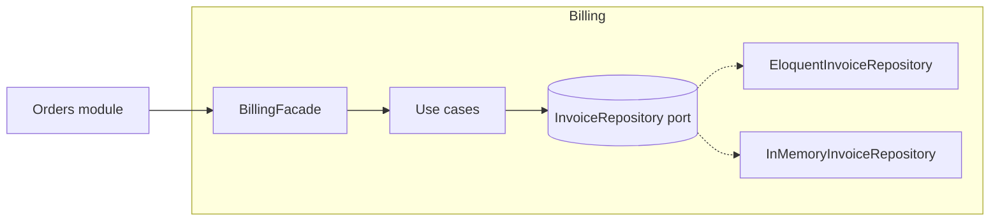

# Decision templates

The shape of what this skill produces, per level and per path, each with one worked example.
The shape matters more than it looks: a decision missing its rejected alternative is the one
nobody can evaluate in six months, and a review missing the direct alternative is criticism
without a request.

**Fill every slot.** An empty slot is a finding — "no rejected alternative" usually means no
alternative was considered.

**The examples are illustrations, not findings.** Re-derive every line from the code in front
of you. A decision or a review that matches an example here more closely than it matches the
actual diff is copied, not made.

---

## NO-PATTERN (Path A, any level)

The most common output of the skill. Stating it is not ceremony: it records that the question
was asked, and it names the trigger that would change the answer.

```
**Force:** <what would vary, and why it does not vary today — name the missing source>
**Choice:** direct code. <the one or two plain pieces, and where the seam between them is>
**Becomes a pattern when:** <the observable trigger — a ticket, a second tenant, a second
provider> → <the pattern that would then absorb it>
```

**Worked example** — ticket: "Verify the signature on incoming Stripe webhooks before
processing them. Ops mentioned we may add Paddle next year."

> **Force:** none today. One payment provider, one signature scheme, one endpoint. "Paddle next
> year" has no contract signed, no ticket, no owner.
> **Choice:** direct code. A middleware that reads the `Stripe-Signature` header, computes the
> HMAC over the raw body with the configured secret, and rejects on mismatch or stale timestamp.
> The HMAC check is its own small method with the secret and the tolerance as arguments — that
> is the seam.
> **Becomes a pattern when:** a second provider has a ticket → the middleware stays, the
> verifier becomes a Strategy keyed by route, designed from both real signature schemes.

What this example refuses: a `WebhookSignatureVerifierInterface`, a provider registry, a
`config/webhooks.php` with one entry, and an abstract `WebhookController`. Each would be
designed from one case and fit the second badly — Paddle signs differently, and an interface
shaped around Stripe's timestamp tolerance would not carry it.

---

## STANDARD (Path A)

Two to four lines, in the chat, before any code.

```
**Force:** <what varies> per <who forces it>, chosen at <when>; <what must stay still>.
**Pattern:** <name>, <how it is wired in this codebase or framework>.
**Rejected:** <the direct or simpler alternative>, because <the concrete cost it would have here>.
**Framework:** <what the stack already provides for this, and whether you are using it>.
```

**Worked example** — "Notify users by SMS as well as email, per their preference."

> **Force:** the channel varies per user preference, chosen per notification at runtime; the
> code that decides *to* notify must not change when a channel is added.
> **Pattern:** Strategy over the channel. Two channels exist today, push is on the Q3 roadmap.
> **Rejected:** a `match` on the preference inside the sender — three cases at one call site
> is fine, but the call site is about to be five, and each channel has its own failure handling.
> **Framework:** Laravel notifications already dispatch by `via()` and ship mail, database and
> Vonage channels. Adding a channel is a `toX()` method; no resolver of our own.

---

## STANDARD (Path B)

Before the first refactoring step. The safety-net line is not optional.

```
**Smell:** <name(s) from code-smells.md>, with the evidence (size, count, repetition).
**Safety net:** <tests exist and are green (paste the run)> | <none → characterization tests
over N representative inputs, now green>.
**Sequence:** <technique> → <technique> → <technique>, one checkpoint each.
**Pattern deferred:** <the pattern the smell hints at> — <why it waits for the YAGNI gate>.
**Out of scope:** <behaviour changes noticed and pinned, to be fixed separately>.
```

**Worked example** — "Clean up `ReminderScheduler::schedule()`; a new clinic type onboards
next month."

> **Smell:** Long Method (`schedule()`, 110 lines, four commented sections), Switch Statements
> (clinic-type branching repeated in the lead-time, the channel choice, and the opening-hours
> check), Magic Numbers (`24`, `48`, `2` for channels).
> **Safety net:** none. Characterization tests: 18 inputs covering every clinic type × channel
> × slot-time branch, outputs frozen with strict equality including int/float and `null` vs
> `''`. Runner: PHPUnit data provider plus a plain-`php` script over the same cases file, since
> `vendor/` is absent. Green.
> **Sequence:** Replace Magic Number with Symbolic Constant → Extract Method per section
> (`leadTime`, `channelFor`, `withinOpeningHours`, `dispatchAt`) → Replace Nested Conditional
> with Guard Clauses in `dispatchAt()`.
> **Pattern deferred:** clinic types want Replace Type Code with Strategy. The new clinic type
> is one line in `leadTime()` and one in `channelFor()`; two lines do not justify a hierarchy.
> Revisit if a third type-dependent rule appears.
> **Out of scope:** evening slots get two reminders because the 24 h and the 2 h rules both
> match. Pinned as-is; fix in its own commit after the extractions, moving the pinned
> expectation in that commit. Whether the 2 h reminder should win or both should send is
> unspecified — asked; if no answer arrives, fix only the duplicate send and state the
> assumption in the commit.

---

## ARCHITECTURAL — Pattern Decisions section

One entry per decision, in the spec or plan, in a lightweight ADR shape. A diagram of the
resulting structure sits with the section, not with each entry.

```
### <Decision title, as a noun phrase: "Persistence boundary for the Billing module">

**Context.** <the forces: what varies, who forces it, what must not move, and the constraints
— team, deadline, regulation, existing conventions>
**Decision.** <the pattern or structure, and how it is wired>
**Alternatives rejected.**
- <alternative A> — <why not, in terms of cost here>
- <alternative B> — <why not>
**Consequences.** <what becomes easier, what becomes harder, what this commits us to,
and the reversibility class: cheap / moderate / expensive (architectural.md)>
**Verified by.** <the tests or checks that prove the decision is implemented as stated>
```

**Worked example** — a new Billing module in a modular monolith.

> ### Persistence boundary for the Billing module
>
> **Context.** Billing must be unit-testable with no database (its rules are the core domain:
> proration, tax, retries), and Billing is the module most likely to be extracted to its own
> service within a year. The rest of the app is Eloquent-on-Active-Record and must stay so.
> Two persistence targets already exist: MySQL in production, an in-memory implementation for
> the rules test-suite.
> **Decision.** Ports & Adapters for Billing only. `InvoiceRepository` is a port defined in
> the module; `EloquentInvoiceRepository` and `InMemoryInvoiceRepository` are its adapters.
> Other modules call Billing only through its published `BillingFacade`.
> **Alternatives rejected.**
> - Eloquent directly, as in the other modules — the rules tests would need a database, and
>   the module would be a service extraction away from a rewrite.
> - Hexagonal for the whole application — the other modules are CRUD; the port cost buys
>   nothing there and the team would abandon it.
> **Consequences.** Billing carries mappers and two adapters; boundary enforced by a
> namespace rule (no `Illuminate\*` inside `Billing\Domain`). Reversibility: moderate — the
> port can be collapsed back onto Eloquent in a day if the extraction never happens.
> **Verified by.** The rules suite runs with the in-memory adapter and no database; an
> architecture test fails on any `Illuminate` import inside `Billing\Domain`; both adapters
> pass one shared contract test.



---

## REVIEW

The shape of a design review, in this order. Behaviour outranks design; a request to remove
an abstraction comes with the smaller shape. Length is proportional to the number of distinct
findings, not to the line count: five real anti-patterns in a 90-line diff earn five sections,
while three paragraphs about one naming choice do not.

```
**Verdict:** approve | approve with nits | request changes — one line of why.
**Re-triage:** <what the diff actually does, in one line, when it differs from its description>

## Blocking (behaviour)
1. `<file>:<line>` — <what fails, with the input that triggers it> — <the fix>.
N. **Tests:** <none | do not cover the behaviour added | fine> — <what is owed>.

## Design
### <the author's justification, quoted>: "<so we can swap the ORM later>"
- <gate question answered: implementations counted, source named or not, framework check,
  direct version sketched>
- Named shape: <anti-pattern or smell, from antipatterns.md / code-smells.md>
- **Ask:** <the concrete change>

## The direct alternative
<a sketch, sized in files and lines, showing the same behaviour without the removed
abstractions; the force / rejected lines for it, as in a STANDARD decision; inline code when
the ask is "replace this", a description when the ask is "delete this">
**Contract changes:** <public signatures the alternative changes, and the variant that keeps
them, or "none">

## Nits
- <non-blocking, clearly labelled>
```

**Worked example** — a PR adding `PdfRendererInterface` with one implementation, an
`InvoiceDocumentBuilderFactory`, a `RenderInvoiceRequestDTO`, and a static
`InvoiceRenderer::instance()`, around "generate a PDF for an invoice". Description: "clean
architecture, just structure, quick approve".

> **Verdict:** request changes — one silent failure, one path that cannot run, and eight
> files for a behaviour the PDF library already exposes in one call.
> **Re-triage:** not "just structure". The diff chooses a template, applies a tax-rounding
> rule, and decides what happens when rendering fails.
>
> ## Blocking (behaviour)
> 1. `InvoiceRenderer.php:31` — `catch (\Throwable) { return null; }` turns a font-loading
>    failure into a `null` the controller then streams as an empty download. Let it propagate;
>    the job's failure path is the framework's.
> 2. `InvoiceRenderer.php:14` — `app(PdfRendererInterface::class)` with no binding in this
>    diff → `BindingResolutionException` on first call.
> 3. `InvoiceDocumentBuilder.php:52` — `round($total * 1.21, 2)` reimplements tax; the
>    `Invoice` model already carries `total_with_tax` computed by the tax service. Two sources
>    of truth, and they already disagree for reverse-charge invoices.
> 4. **Tests:** none. The rounding rule and the "credit note renders with a negative total"
>    case are the behaviours worth pinning; both are ten-line feature tests.
>
> ## Design
> ### "Renderer interface so we can switch PDF libraries"
> - One implementation; no second named. The interface takes a Blade view name and returns a
>   `DomPDF` object, so every caller is coupled to the library through the return type — the
>   switch it promises is not possible.
> - Named shape: *Abstraction on top of a stable dependency*; Speculative Generality.
> - **Ask:** drop the interface; call the library's facade from one place.
> ### "Builder factory so new document types are trivial"
> - `make(string $type)` ignores `$type` and returns the one concrete builder. Nothing a second
>   type could implement.
> - Named shape: *Factories all the way down*; *Pattern-name theatre*.
> - **Ask:** one `InvoicePdf` class with a `render(Invoice)` method; a credit note is a second
>   Blade view, not a second builder.
> ### "Singleton so it can be reached from jobs and controllers"
> - Reachability is what the container already provides, with an explicit dependency and no
>   state leaking across queue-worker runs. The constructor is public, so it is not even single.
> - **Ask:** delete `instance()`; inject.
> ### The DTO
> - `RenderInvoiceRequestDTO { int $invoiceId }` travels from a public method to the private
>   method beneath it. No boundary crossed.
> - **Ask:** pass the `Invoice`.
>
> ## The direct alternative
> Two files, ~30 lines: `InvoicePdf::render(Invoice $invoice): string` using the library
> facade over the existing Blade view and the model's `total_with_tax`; a queued
> `GenerateInvoicePdf` job that calls it and stores the result. Force: none today — one
> library, one document type. Rejected: keeping the interface "since it exists" — one
> implementation, and its return type already leaks the library.
> **Contract changes:** `render(int $invoiceId)` becomes `render(Invoice $invoice)`. If callers
> only hold an id, keep the `int` signature and open with `findOrFail`, which is also the fix
> for the null path.
>
> ## Nits
> - `// only PDF for now` goes with the factory.
> - "Clean architecture" in the title: none of the interfaces sit at a module boundary.

---

## Verification report (Step 6, every path)

After implementing — or, in Path C, for the alternative you proposed — three lines, even when
the answer is "nothing to change".

**Path C variant:** the audit runs on your sketch, so the counts are what the alternative
*would* have, "Tests on the axis" names what the author still owes, and "Simplified" records
what your sketch removed from theirs.

```
**Audit:** <interfaces added / implementations>, <new files>, <generic components with one
consumer>, <rejected alternative present? yes/no>.
**Tests on the axis:** <which tests exercise the variation or the pinned behaviour, and
whether they ran — "not run: no runner installed" is a valid line, "passing" without a run
is not>.
**Simplified:** <what was inlined or deleted after the audit, or "nothing — direct version
re-sketched, still worse">.
```

> **Audit:** 0 interfaces; 2 files (middleware, test); the HMAC helper has one caller and is
> the declared seam.
> **Tests on the axis:** feature test for a valid signature, a tampered body, and a stale
> timestamp; run green.
> **Simplified:** removed a `config/webhooks.php` with one entry — the secret lives in the
> existing `services.stripe` config.
