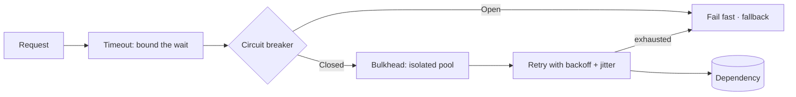

# Distributed, cloud and messaging patterns

The moment a call crosses a process boundary, it can be slow, fail, arrive twice, arrive out of
order, or arrive after you gave up. These patterns exist to make that survivable.

They compensate for the *fallacies of distributed computing*: that the network is reliable,
latency is zero, bandwidth is infinite, the network is secure, topology never changes, there is
one administrator, transport cost is zero, and the network is homogeneous. Every one of these
is false, and every pattern below is a mitigation for one of them.

Catalogues: <https://learn.microsoft.com/azure/architecture/patterns/> (44 cloud patterns) and
<https://www.enterpriseintegrationpatterns.com/patterns/messaging/toc.html> (65 messaging
patterns). Original commentary.

---

## Resilience — surviving other people's failures

**The core four, always together.** Each is incomplete without the others.

### Timeout

- **Intent** — Give up after a bounded wait.
- **Why first** — Without a timeout, every other resilience pattern is useless: a hung call holds a connection, a worker, and eventually the whole pool. The default timeout in most HTTP clients is far too long or absent entirely.
- **Rule** — Every outbound call has an explicit timeout. No exceptions.

### Retry

- **Intent** — Repeat an operation that failed transiently.
- **Mandatory details** — **Exponential backoff** with **jitter** (random spread), a **cap** on attempts, and retries **only on transient errors**. Retrying a `422` is pointless; retrying a `429` without honouring `Retry-After` is hostile.
- **Danger** — Naive retries cause *retry storms*: the dependency slows, everyone retries, the load triples, it dies. Synchronised retries without jitter are a self-inflicted DDoS.
- **Requires** — Idempotency. Retrying a non-idempotent write creates duplicates. See Idempotent Receiver.

### Circuit Breaker

- **Intent** — Stop calling a dependency that is clearly down; fail fast instead.
- **States** — *Closed* (calls pass, failures counted) → *Open* (calls fail immediately, no traffic sent) → *Half-Open* (a trickle of probes; success closes it, failure re-opens).
- **Why it pairs with Retry** — Retry handles a blip; the breaker handles an outage. Retry alone turns an outage into an amplified outage.
- **Cost** — State to hold and tune. Thresholds that are too tight cause flapping; too loose and it never trips.

### Bulkhead

- **Intent** — Isolate resources into pools so one failing dependency cannot consume everything.
- **Example** — Separate connection pools and worker queues per downstream service, so a slow payment provider cannot exhaust the workers that serve everything else.
- **Named after** — Ship compartments: a hull breach floods one section, not the vessel.

### Supporting resilience patterns

| Pattern | Intent |
|---|---|
| **Throttling / Rate Limiting** | Cap consumption to protect yourself and respect others' limits |
| **Queue-Based Load Leveling** | A queue buffers spikes so the consumer sees a smooth rate |
| **Compensating Transaction** | Undo a completed step when a later step fails — there is no distributed rollback |
| **Health Endpoint Monitoring** | Expose a check that reflects real dependency health, not just "process is alive" |
| **Leader Election** | One instance coordinates, so scheduled work does not run N times |
| **Scheduler Agent Supervisor** | Coordinate distributed steps, detect and remediate failed ones |
| **Fallback / Graceful Degradation** | Serve cached, partial, or default results rather than an error |

---

## Consistency across services

### Saga

- **Intent** — A business transaction spanning services, as a sequence of local transactions each with a compensating action.
- **Why** — There is no two-phase commit across HTTP. Distributed atomicity is not available; sequenced local transactions plus compensation is.
- **Two styles** — *Choreography*: each service reacts to events, no coordinator. Simple with few steps, becomes untraceable beyond four or five. *Orchestration*: one coordinator drives the steps. More visible, easier to debug, a single component to own.
- **Cost** — Compensations are business logic, not rollbacks. "Un-shipping" a package is a refund and a return process. Intermediate states are visible to users, and must be designed for.

### Transactional Outbox

- **Problem** — You must update the database *and* publish an event. Two systems, no shared transaction. Publish first and the write may fail; write first and the publish may fail. Either way, state and events diverge.
- **Solution** — Write the event to an `outbox` table **inside the same transaction** as the state change. A separate relay reads the table and publishes, marking rows sent.
- **Guarantee** — At-least-once delivery, which is why consumers must be idempotent.
- **Verdict** — Non-negotiable in any system where a database write must produce a reliable event. The naive "save then dispatch" loses events on every crash between the two.

### Idempotent Receiver

- **Problem** — At-least-once delivery means duplicates. Always.
- **Solution** — Every message carries a unique ID; the consumer records processed IDs and skips repeats. Or make the operation naturally idempotent (`SET status = 'paid'` rather than `balance = balance - 10`).
- **Rule** — Assume every message will arrive twice, because eventually it does.

### Related consistency patterns

| Pattern | Intent |
|---|---|
| **Event Sourcing** | Events are the source of truth — see [architectural.md](architectural.md#event-sourcing) |
| **CQRS** | Separate read and write models — see [architectural.md](architectural.md#cqrs-command-query-responsibility-segregation) |
| **Materialized View** | Precomputed read-optimised projection |
| **Index Table** | Secondary indexes over stores that lack them |
| **Sequential Convoy** | Keep related messages ordered without blocking unrelated groups |

---

## Gateways, proxies and topology

| Pattern | Intent |
|---|---|
| **API Gateway** | One entry point: routing, auth, TLS, rate limiting |
| **Gateway Routing** | Route to services behind a single endpoint |
| **Gateway Aggregation** | Combine several backend calls into one client call — kills chatty mobile clients |
| **Gateway Offloading** | Move shared concerns (TLS, auth, compression) into the gateway |
| **Backends for Frontends (BFF)** | A tailored backend per client type instead of one compromise API |
| **Sidecar** | Support functionality in a separate co-deployed process (logging, proxying, secrets) |
| **Ambassador** | A sidecar specifically for outbound network calls, carrying retry/breaker logic |
| **Anti-Corruption Layer** | Translate at the border so a foreign model does not leak in |
| **Gatekeeper** | A hardened validating host in front of private backends |
| **Valet Key** | Hand the client a scoped token for direct resource access (pre-signed upload URLs) |
| **Federated Identity** | Delegate authentication to an identity provider |
| **Strangler Fig** | Migrate a legacy system incrementally behind a router |
| **Deployment Stamps** | Independent copies of the whole stack per tenant group or region |
| **Geode** | Geographically distributed nodes, any node serves any request |
| **Sharding** | Horizontal partitioning of a data store |
| **Static Content Hosting** | Serve static assets from storage/CDN, not the application |
| **Compute Resource Consolidation** | Combine small workloads into one compute unit to cut cost |
| **Quarantine** | Validate external assets before the workload consumes them |

---

## Caching

| Pattern | How | Trade-off |
|---|---|---|
| **Cache-Aside** | App checks cache, loads on miss, populates | The default. Stale windows are your responsibility |
| **Read-Through** | Cache loads from the store itself on miss | Simpler callers, needs cache-layer support |
| **Write-Through** | Write to cache and store together | Consistent, slower writes |
| **Write-Behind** | Write to cache, flush to store asynchronously | Fast writes, risk of loss on crash |
| **Refresh-Ahead** | Refresh hot entries before expiry | Avoids latency spikes, wastes work on cold keys |

**The three failure modes** worth knowing by name: *stampede* (many misses at once all
recomputing — cure: locking or single-flight), *penetration* (repeated misses for keys that do
not exist — cure: cache the negative result), and *avalanche* (many keys expiring at the same
instant — cure: jittered TTLs).

Cache invalidation is genuinely hard. Prefer short TTLs and explicit invalidation on write over
clever schemes; the clever scheme is where the stale-data incident comes from.

---

## Messaging and integration

The EIP catalogue is 65 patterns. These are the ones that come up repeatedly.

### Channels

| Pattern | Intent |
|---|---|
| **Point-to-Point Channel** | Exactly one consumer receives each message |
| **Publish-Subscribe Channel** | Every subscriber receives a copy |
| **Dead Letter Channel** | Where messages go when they cannot be processed — *configure this before you need it* |
| **Guaranteed Delivery** | Persist messages so a broker restart does not lose them |
| **Message Bus** | Shared infrastructure connecting many systems |
| **Messaging Bridge** | Connect two otherwise incompatible messaging systems |

### Message construction

| Pattern | Intent |
|---|---|
| **Command Message** | "Do this" — one intended handler |
| **Document Message** | "Here is data" — the receiver decides what to do |
| **Event Message** | "This happened" — fan-out, no expectation of response |
| **Request-Reply** | Two-way conversation over one-way channels |
| **Correlation Identifier** | Match a reply to its request; also the backbone of distributed tracing |
| **Return Address** | The sender says where the reply goes |
| **Message Expiration** | A TTL, so stale work is not processed hours late |

Distinguishing **Command** from **Event** is the design decision that matters. A command names
a receiver and an intent ("charge this card"); an event names a fact and cares not who listens
("payment succeeded"). Commands couple sender to receiver; events do not. Publishing commands
disguised as events is the most common event-driven design error.

### Routing

| Pattern | Intent |
|---|---|
| **Content-Based Router** | Route by inspecting the message |
| **Message Filter** | Drop messages that do not match |
| **Recipient List** | Send to a computed set of receivers |
| **Splitter** | One message becomes many |
| **Aggregator** | Many messages become one — stateful, needs a completeness rule and a timeout |
| **Scatter-Gather** | Broadcast, then aggregate the responses |
| **Resequencer** | Restore order to messages that arrived out of order |
| **Routing Slip** | The message carries its own list of processing steps |
| **Process Manager** | Central coordinator for a multi-step flow — this is Saga orchestration |
| **Competing Consumers** | Several consumers on one channel for parallel throughput |

### Transformation and endpoints

| Pattern | Intent |
|---|---|
| **Message Translator** | Convert between message formats |
| **Content Enricher** | Add data the receiver needs but the sender lacked |
| **Content Filter** | Strip data the receiver must not see |
| **Claim Check** | Store a large payload, pass a reference — keeps the bus fast |
| **Canonical Data Model** | One internal format; translate at every edge, so N systems need N translators, not N² |
| **Normalizer** | Bring varied formats to a common one |
| **Messaging Gateway** | Hide messaging APIs behind a domain interface |
| **Polling Consumer** ↔ **Event-Driven Consumer** | Pull versus push consumption |
| **Idempotent Receiver** | Tolerate duplicates safely |
| **Durable Subscriber** | Receive messages published while you were offline |
| **Service Activator** | One service reachable both by messaging and direct call |

### Observability

| Pattern | Intent |
|---|---|
| **Wire Tap** | Copy messages to a secondary channel for inspection |
| **Message History** | Each message carries the list of components it passed through |
| **Message Store** | Central archive for later analysis |
| **Control Bus** | Separate channel for management and configuration commands |
| **Detour** | Route messages through validation or debugging when enabled |

In distributed systems, observability is not optional tooling — it *is* the debugger. Correlation
IDs propagated through every hop, structured logs, and distributed tracing are the minimum. Without
them, a failure spanning four services is not diagnosable at all.

---

## Choosing: the honest defaults

1. **Do not distribute until you must.** Every pattern here is compensation for a boundary you chose to create. A modular monolith needs almost none of them.
2. **Timeout + Retry-with-backoff-and-jitter + Circuit Breaker on every outbound call.** This is the baseline, not an advanced technique.
3. **Assume at-least-once delivery.** Design consumers to be idempotent from day one; retrofitting idempotency after duplicate charges is not a pleasant project.
4. **Transactional Outbox whenever a write must produce an event.** "Save then dispatch" loses events.
5. **Dead letter channel configured before launch.** Otherwise poison messages either block the queue or vanish.
6. **Correlation IDs from the first line of code.** Free to add early, painful to retrofit.

---

## Sources

Microsoft, *Cloud Design Patterns* — <https://learn.microsoft.com/azure/architecture/patterns/> ·
Gregor Hohpe & Bobby Woolf, *Enterprise Integration Patterns* —
<https://www.enterpriseintegrationpatterns.com> · Michael Nygard, *Release It!* (Circuit Breaker,
Bulkhead, stability antipatterns) · Chris Richardson, *Microservices Patterns* (Saga, Outbox).
Original commentary.
