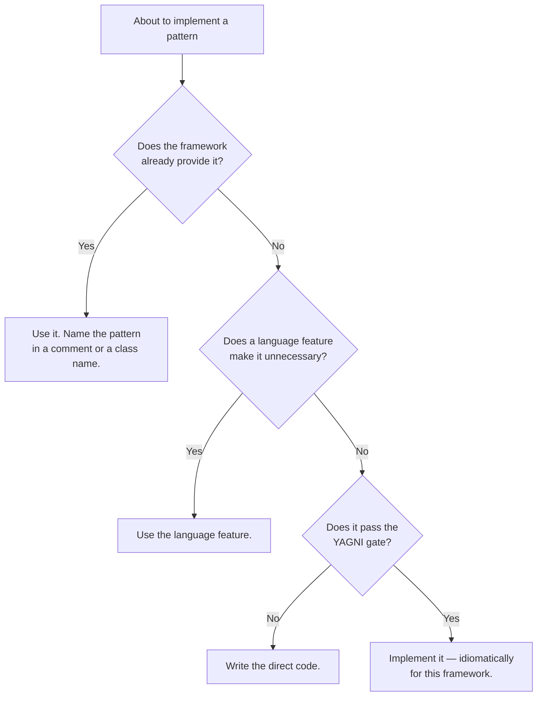

# Framework idioms

**Read this before hand-rolling any pattern.** Most GoF patterns already exist in your
framework, usually better tested than your version will be. Naming the pattern the framework
implements is valuable — it explains why the code is shaped that way. Reimplementing it is not.

---

## Laravel / PHP

### What the framework already gives you

| Pattern | Where it already lives | Do this, not that |
|---|---|---|
| **Abstract Factory + DI** | The service container | `$this->app->bind(Port::class, Adapter::class)`. Do not write a factory class to pick an implementation |
| **Factory Method** | `bind()` with a closure; contextual binding | Contextual binding gives different implementations per consumer |
| **Singleton** | `$this->app->singleton()` | One instance, injected, testable. Never a static `getInstance()` |
| **Strategy** | Container binding by key, or the Manager pattern (`Cache`, `Queue`, `Mail`) | Extend an existing manager with `extend()` before writing a new resolver |
| **Chain of Responsibility** | Middleware; `Illuminate\Pipeline\Pipeline` | `Pipeline::send($x)->through([...])->thenReturn()`. Do not build a handler chain by hand |
| **Observer** | Events + listeners; model observers; `Model::booted()` | Model events for lifecycle; domain events for cross-module fan-out |
| **Command** | Queued jobs; console commands; `Bus::dispatch()` | A job *is* a Command object: serialisable, retryable, delayable |
| **Active Record** | Eloquent | Accept it. See below on Repository |
| **Data Mapper** | Doctrine, if you deliberately chose it | Do not simulate it on top of Eloquent |
| **Unit of Work** | `DB::transaction()`; Doctrine's `EntityManager` | Eloquent has no change tracker — the transaction is the boundary |
| **Query Object** | Eloquent scopes; custom `Builder` classes | A scope is a composable query object. Prefer this over a repository method dump |
| **Specification** | Scopes + `when()`; conditional builder chains | Composable rules without a specification framework |
| **Decorator** | Container `extend()`; middleware; cache/log wrappers | `$this->app->extend(Client::class, fn($c) => new LoggingClient($c))` |
| **Proxy** | Eloquent lazy relations; `Lazy` collections; deferred providers | Already there — the risk is N+1, not the pattern |
| **Adapter** | Filesystem (Flysystem), Mail, Queue, Cache drivers | Write a driver, register it with `extend()` |
| **Facade** *(GoF)* | Service classes with a narrow API | **Laravel Facades are not the GoF Facade** — they are a static Service Locator over the container |
| **Template Method** | Abstract base classes: `FormRequest`, `TestCase`, `Notification` | Extend the provided base rather than inventing a parallel lifecycle |
| **Builder** | Query Builder; `Notification`/`Mailable` fluent APIs | The idiom is fluent methods returning `$this`, then a terminal method |
| **Iterator** | `IteratorAggregate`, generators, `cursor()`, `lazy()`, `chunk()` | `Model::lazy()` streams rows; never `->all()` on a large table |
| **Value Object** | Custom casts (`CastsAttributes`); `Stringable`; enums | Casts turn a column into a value object transparently |
| **Null Object / Special Case** | `optional()`, nullsafe `?->`, `Collection::whenEmpty()` | |
| **Repository** | *Not provided, deliberately* | See below |
| **Circuit Breaker / Retry** | `Http::retry()`; `RateLimiter`; job `backoff()` and `retryUntil()` | Built in. Do not hand-roll retry loops |
| **Transactional Outbox** | Not provided | Implement it — see [distributed-patterns.md](distributed-patterns.md#transactional-outbox) |
| **Front Controller / Page Controller** | `public/index.php` + routing; invokable controllers | |
| **Template View / Two Step View** | Blade; layouts and components | |
| **Client Session State** | Sanctum tokens, JWT | vs `session` driver = Server/Database Session State |

### Repository over Eloquent: when is it justified?

The most-argued decision in Laravel codebases. Be explicit about which case you are in.

**Justified when:**
- The domain must be unit-testable with no database *and* the rules are complex enough for that to pay off.
- You are behind a Ports & Adapters boundary and the repository is the port.
- Persistence genuinely may change — not "in theory", but as a known requirement.
- You are writing a package that must not force a persistence choice on consumers.

**Not justified when:**
- "It is best practice." Eloquent *is* Active Record; the pattern is already chosen.
- "For testing." `RefreshDatabase` with an in-memory or transactional database is usually faster to write and catches more than mocked repositories, which mostly assert that your mocks agree with themselves.
- "To swap the database." You will not, and the ORM was already that abstraction.

**The middle path most teams should take:** Eloquent models + a thin Service/Action layer for
use cases + query scopes for named queries. You get testable use cases and named queries
without a persistence abstraction that fights the framework.

### PHP language features that replace patterns

| Feature | Replaces |
|---|---|
| **Enums** (backed, with methods) | Replace Type Code with Class; State when transitions are simple; whole Strategy hierarchies |
| **First-class callable syntax** `$obj->method(...)` | Strategy and Command objects for single-method cases |
| **Readonly properties / classes** | Immutable value objects without hand-written guards |
| **Constructor property promotion** | Boilerplate in value objects and DTOs |
| **Named arguments** | Long Parameter List, in many cases, and the Builder for simple objects |
| **Attributes** | Metadata Mapping; declarative routing, validation and listeners |
| **Generators** | Iterator; streaming large datasets without memory blowup |
| **`match`** | Simple Strategy dispatch. **Two branches do not need a pattern** |
| **Interfaces + union types** | Sum types, approximately |

---

## Vue / TypeScript frontend

| Pattern | Where it already lives |
|---|---|
| **Observer** | Reactivity: `ref`, `reactive`, `computed`, `watch` |
| **Strategy** | A composable or a function passed as a prop |
| **Template Method** | Scoped slots — the parent owns the algorithm, the consumer supplies the steps |
| **Composite** | Recursive components; the component tree itself |
| **Decorator** | Wrapper components; composables composing other composables |
| **Registry / Provider** | `provide` / `inject`; Pinia stores |
| **Command** | Store actions; dispatched events |
| **Facade** | A composable exposing a narrow API over complex logic |
| **Proxy** | Vue's reactivity is *literally* a `Proxy` |
| **State** | State machine libraries (XState), or a discriminated union in the store |
| **Adapter** | An API client layer mapping server DTOs to view models |
| **Memento** | History in a store; undo stacks |

**TypeScript features that replace patterns:**

| Feature | Replaces |
|---|---|
| **Discriminated unions + exhaustive `switch`** | Visitor, State, and most polymorphic dispatch |
| **Branded / nominal types** | Value objects for identifiers |
| **`satisfies` and `as const`** | Runtime config validation |
| **Generics with constraints** | Template Method, type-safely |
| **Utility types** (`Pick`, `Omit`, `Partial`) | Hand-written DTO variants |
| **Zod / Valibot schemas** | Parse-don't-validate at the boundary; derived types for free |

**Do not** hand-roll an event emitter, a DI container, or a state store in a Vue app. All three
exist, are tested, and integrate with devtools.

---

## The rule

When you *do* implement a pattern, implement it the way the framework would: register it in the
container, follow the existing naming, use the provided base classes. A technically correct
pattern implemented against the grain of the framework is harder to maintain than a slightly
less pure one that looks like the rest of the codebase.

---

## Sources

Laravel documentation and framework source · Vue and TypeScript documentation · PHP RFCs for the
language features listed. Original commentary.
