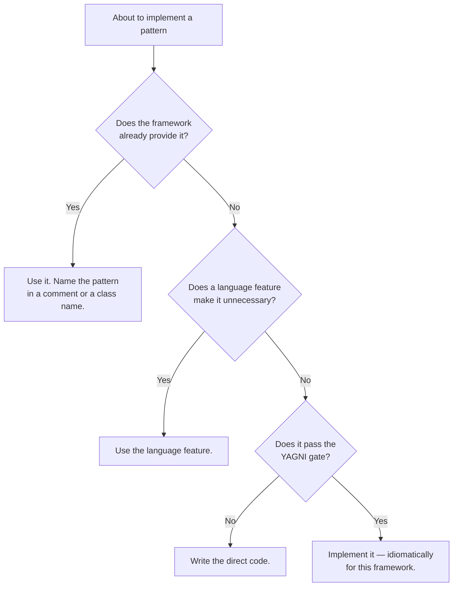

# Framework idioms — router

**Read the file for your stack before hand-rolling any pattern.** Most GoF patterns already
exist in your framework, better tested than your version will be.

Naming the pattern the framework implements is valuable — it explains why the code is shaped
that way. Reimplementing it is not.

---

## Pick your stack

| Stack | File |
|---|---|
| **Laravel · Symfony · PHP** | [idioms/laravel-php.md](idioms/laravel-php.md) |
| **Django · FastAPI · Python** | [idioms/django-python.md](idioms/django-python.md) |
| **Rails · Ruby** | [idioms/rails-ruby.md](idioms/rails-ruby.md) |
| **Spring · Java · Kotlin** | [idioms/spring-java.md](idioms/spring-java.md) |
| **ASP.NET Core · C#** | [idioms/dotnet-csharp.md](idioms/dotnet-csharp.md) |
| **NestJS · Express · Node/TypeScript** | [idioms/node-typescript.md](idioms/node-typescript.md) |
| **Vue · Nuxt · TypeScript** | [idioms/vue-typescript.md](idioms/vue-typescript.md) |
| **React · Next.js · TypeScript** | [idioms/react-typescript.md](idioms/react-typescript.md) |
| **Go** | [idioms/go.md](idioms/go.md) |
| **Rust** | [idioms/rust.md](idioms/rust.md) |

Plain PHP, Python, Ruby or TypeScript with no framework? Open the same-language file and use
its "language features that replace patterns" section; skip the framework tables.

Stack not listed? The rule below still applies — check the framework's own vocabulary for the
pattern before building it. Frameworks converge on the same solutions; the names differ.

---

## The rule, regardless of stack

When you *do* implement a pattern, implement it the way the framework would: register it where
the framework registers things, follow the existing naming, extend the provided base classes.

**A technically correct pattern implemented against the grain of the framework is harder to
maintain than a slightly less pure one that looks like the rest of the codebase.** Every
developer who joins already knows the framework's idiom; nobody knows yours.

---

## The three questions that repeat across every stack

Each stack file answers these in its own terms, because the answers differ and the arguments
are perennial.

### 1. Is a Repository justified over the framework's ORM?

Depends entirely on whether the ORM is Active Record (Eloquent, Django ORM, ActiveRecord) or
Data Mapper (Doctrine, Hibernate, EF Core). Layering a Repository over an Active Record ORM
means paying for both patterns and getting the benefits of neither. Over a Data Mapper it is
often redundant, because the mapper *is* the abstraction.

See [enterprise-patterns.md](enterprise-patterns.md#data-source-architecture).

### 2. Where does business logic live?

Every ecosystem has this argument under a different name: fat models vs service objects, use
cases vs application services, "skinny controllers" vs "skinny everything". The honest answer
is in [enterprise-patterns.md](enterprise-patterns.md#domain-logic): pick by the complexity of
the *rules*, not the size of the app.

### 3. What does dependency injection cost here?

Some stacks give you a container for free and injection is the path of least resistance
(Spring, .NET, Laravel, NestJS). Others make explicit passing more idiomatic (Go, Rust, much
of Python). Fighting the local default produces code nobody in that ecosystem enjoys reading.

---

## Cross-stack quick reference

Where each ecosystem hides the same pattern:

| Pattern | PHP/Laravel | Python/Django | Ruby/Rails | Java/Spring | C#/.NET | Node/Nest | Go | Rust |
|---|---|---|---|---|---|---|---|---|
| **DI container** | Service container | Manual / `dependency-injector` | Manual / initializers | `ApplicationContext` | `IServiceCollection` | Nest DI | Explicit args | Explicit args |
| **Chain of Responsibility** | Middleware, `Pipeline` | Middleware | Rack middleware, `around_action` | `HandlerInterceptor`, filters | Middleware pipeline | Middleware, guards, interceptors | `http.Handler` wrapping | Tower `Layer` |
| **Observer** | Events + listeners | Signals | ActiveSupport notifications, callbacks | `ApplicationEvent` | `MediatR` notifications | `EventEmitter2` | Channels | Channels, `tokio::sync` |
| **Command** | Queued jobs | Celery tasks | ActiveJob | `@Async`, Spring Batch | `MediatR` `IRequest` | Bull jobs, CQRS module | Worker + channel | Task + channel |
| **Active Record** | Eloquent | Django ORM | ActiveRecord | — | — | — | — | — |
| **Data Mapper** | Doctrine | SQLAlchemy | — | Hibernate/JPA | EF Core | TypeORM, Prisma | sqlc, sqlx | Diesel, SeaORM |
| **Unit of Work** | `DB::transaction` | `atomic()` | `transaction` | `@Transactional` | `SaveChanges` | `QueryRunner` | `sql.Tx` | Transaction guard |
| **Decorator** | Container `extend()` | Decorators, mixins | Modules, `prepend` | `@Aspect` (AOP) | Decorators, `IPipelineBehavior` | Interceptors | Struct embedding | Trait impl / newtype |
| **Strategy** | Container binding | Callable / protocol | Duck typing, blocks | Interface + `@Qualifier` | Interface + keyed services | Provider token | Interface | Trait object |
| **Template Method** | Abstract base class | Abstract base class | Module + hooks | Abstract class | Abstract class | Abstract class | Interface + embedding | Trait default methods |
| **Iterator** | Generators, `lazy()` | Generators, iterators | Enumerable | `Stream` | `IEnumerable`, `IAsyncEnumerable` | Async iterators | `range`, iterators | `Iterator` trait |
| **Null Object** | `optional()`, `?->` | `None` + guards | `NullObject`, `&.` | `Optional` | Nullable refs, `?.` | `??`, optional chaining | Zero values | `Option<T>` |
| **Result/Either** | Custom class | `Result` libs, exceptions | `Dry::Monads` | `Either` (Vavr) | `OneOf`, `FluentResults` | `neverthrow`, discriminated unions | `(T, error)` | `Result<T, E>` |

Go and Rust deserve a note: both deliberately omit much of the classic catalogue. Go's zero
values, interfaces and explicit errors remove the need for Null Object, Abstract Factory and
much of the creational family. Rust's ownership model, `Option`/`Result` and traits do the
same, and make Singleton actively hard on purpose. In both, reaching for a GoF pattern is
usually a sign of writing another language's code in their syntax.
