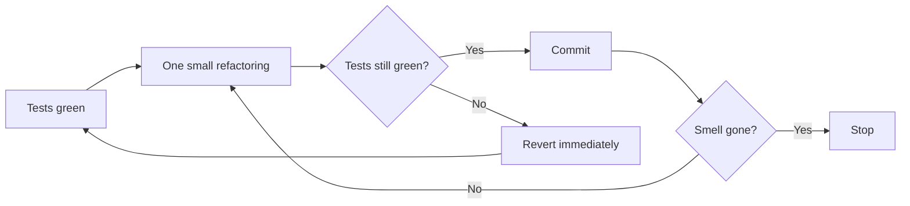
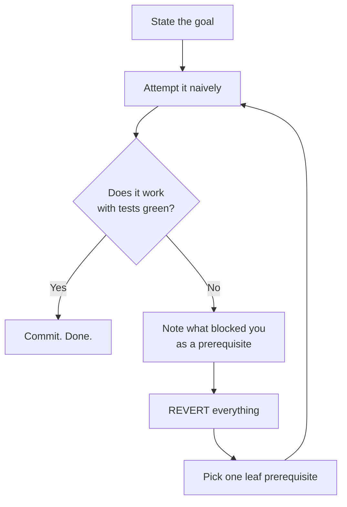

# Refactoring safely

The catalogue tells you *what* to change. This file is *how to change it without breaking
production* — which is the part that actually decides whether a refactor succeeds.

---

## The three laws

1. **Refactoring never changes observable behaviour.** If behaviour changes, it is a rewrite, and it needs its own tests, its own review, and its own commit.
2. **Never refactor and fix a bug in the same commit.** Reviewers cannot separate the two, and a revert throws away the wrong half.
3. **Never refactor without a green test suite.** Without it you are editing and hoping.

Law 3 is the one people skip in legacy code, and it is exactly where it matters most.

---

## The loop



**Revert, don't debug.** When a refactoring step breaks tests, the step was too big. Reverting
costs seconds; debugging a half-finished structural change costs an afternoon and often ends
in a worse state than it started.

**Checkpoint at every green point.** One checkpoint per named technique applied to one target:
"constants introduced", "pricing extracted", "guard clauses in `process()`". Not one per line,
not one for the whole refactor. Commit at each checkpoint when the workflow allows commits;
otherwise stop there, report the green run, and let the owner commit.

A branch with 40 tiny green commits can be reviewed, bisected and partially reverted. One
4,000-line "refactor" commit can only be trusted or rejected wholesale, and reviewers always
trust it, which is how refactors ship bugs.

---

## When there are no tests

The normal state of legacy code. The trap is: you cannot safely refactor without tests, and
you often cannot write tests without refactoring first. Break the deadlock in this order.

### 1. Characterization tests

Write tests that capture what the code does **now** — bugs included. You are not asserting
correctness, you are pinning behaviour so you will notice if it moves.

```
1. Write a test calling the code with realistic input.
2. Assert something you know is wrong, e.g. assertEquals("PLACEHOLDER", $result).
3. Run it. The failure message tells you the actual value.
4. Paste the actual value into the assertion.
5. Repeat until the important paths are pinned.
```

**Generate, don't hand-write.** For a function over data, write a one-off script (kept out of
the repository; only the cases file and the test are committed) that runs the
*current* code over 10–20 representative inputs (each branch, each boundary, the empty case) and
freezes the actual outputs into a cases file. Assert with **strict equality, types included** —
an `int` `0` becoming a `float` `0.0` is exactly the drift a refactor introduces and loose
equality hides. If no test runner is installed, a plain script that walks the cases file and
exits non-zero on drift is a valid net; keep the cases in a format the real runner can consume
later.

If you discover a bug this way, **do not fix it here**. Pin the buggy behaviour, note it, and
fix it in a separate change afterwards. Something downstream may depend on the bug. The pinned
expectation moves **only in the fix commit**, so the diff shows exactly which behaviour changed
and why — and it moves **one named case at a time**. Never re-run the generator over the whole
file to re-pin: that silently accepts every other drift along with the one you meant. If the correct behaviour is ambiguous — "this looks wrong" is not a spec — ask; never
guess a specification inside a refactor.

### 2. Find a seam

A *seam* is a place where you can change behaviour without editing the code there. It is what
makes untestable code testable. In order of preference:

| Seam | How | Cost |
|---|---|---|
| **Parameter** | Pass the dependency in instead of constructing it | Cleanest. Change the signature, update callers |
| **Constructor injection** | Take the collaborator in the constructor, default to the real one | Very low, backward compatible |
| **Extract Interface + inject** | Interface for the dependency, inject an implementation | Low, and it is the entry point to Strategy/Repository |
| **Extract and override** | Move the untestable call into a `protected` method; override it in a test subclass | Ugly but effective. Fastest route into hostile code |
| **Container / DI binding** | Rebind the dependency in the test | Free if the framework already resolves it |
| **Global function shim** | Namespace-local function override, monkey-patching | Last resort. Fragile, and it hides the design problem |

The classic blockers are `new` inside a method, static calls, singletons, `time()`/`rand()`,
and direct filesystem or HTTP access. Each of those is a seam waiting to be introduced.

### 3. Sprout and wrap

When code is too dangerous to touch at all:

- **Sprout Method/Class** — write the new behaviour in a *new*, fully tested method or class, and call it from one line in the old code. The old mess stays untested; the new code is clean.
- **Wrap Method/Class** — rename the old method, create a new one with the original name that calls the old one plus your addition. Callers are untouched.

These add behaviour without refactoring the existing mess. That is a legitimate outcome — a
whole file does not have to be redeemed for you to safely add a feature.

---

## Approval / snapshot testing for legacy output

When a legacy routine produces a large output — a generated document, a report, a payload, an
HTML page — do not hand-write assertions.

1. Capture current output to a file, committed as the approved baseline.
2. The test regenerates output and diffs it against the baseline.
3. Any structural change shows as a diff you review deliberately.

This gives broad safety cheaply, and is often the only practical net around a 900-line report
generator. It is coarse — it will not tell you *why* something changed — so pair it with
targeted unit tests on the parts you are actively refactoring.

---

## Preparatory refactoring

Kent Beck: *"Make the change easy (warning: this may be hard), then make the easy change."*

A feature that lands on messy code is two pieces of work, not one:

1. **Path B first, in its own commits.** Refactor until the feature is a small, obvious addition. Tests green at every checkpoint, behaviour unchanged.
2. **Path A second, in its own commit.** Add the feature. The diff is now small enough to review on its own terms.

**Never both in one diff.** A reviewer cannot tell the structural moves from the behavioural
ones, a bisect lands on a commit that did both, and a revert throws away the wrong half.

**Scope is the feature's footprint.** Refactor what the feature touches — the method it must
extend, the class it must call — and nothing else. Boy Scout scope, not a redesign.

**The typical shape:** a new variant is coming — a "silver" tier next to gold and platinum, a
new country, a new channel. Extract the seam now (the tier rule into its own method, the
country lookup into a table) as a refactoring. Next week the variant is a one-line change at one
place, instead of an edit to a 90-line method with five other concerns in it. Whether the seam
then becomes a pattern is a separate decision at the YAGNI gate; the seam alone is usually
enough.

---

## Parallel Change (expand / contract)

For changing anything with **live callers** you do not control in one atomic step: a method
signature used across the codebase, a public API, a message format, a database schema.

1. **Expand** — add the new alongside the old. New parameter with a default, new method next to the old, new column next to the old, new API field or version. Nothing existing breaks.
2. **Migrate** — move callers, consumers and data to the new shape, one at a time, each step shippable.
3. **Contract** — remove the old once nothing reads it. Verify "nothing" with logs or traffic, not with grep alone.

**Cost** — Two shapes coexist for a while, and the contract step is the one teams forget. Put a
date or a ticket on it; an expand with no contract is permanent duplication.

**Public APIs** — the same three steps with a longer middle. Add the field or the version,
support both, deprecate with a date, remove. Consumers should be *tolerant readers* (ignore
unknown fields, do not depend on ordering) so that expand steps are invisible to them.

### Refactoring the schema

Every schema refactoring is Parallel Change across **separate deploys**, because the code and
the schema cannot change atomically and a bad migration cannot be reverted cheaply.

```
expand (add column/table)  →  backfill  →  verify counts and samples
   →  switch reads  →  switch writes  →  contract (drop old), a deploy later
```

- **Never a destructive change in the same deploy as the code that stops needing it.** The drop goes out one deploy after the last reader is gone, so the previous release still works if you roll the code back.
- **Before creating an index, check it does not already exist.** A migration that fails halfway leaves the indexes created before the failure in place; re-running it then fails on the first one. Guard every index creation with an existence check.
- **Before a UNIQUE index, query for duplicates.** If any exist, the index creation fails. Clean the duplicates in the same migration, *before* the index statement, so the migration is self-contained and repeatable.
- **A rollback undoes the last *successful* migration, not the one that failed.** Check the migration status before suggesting a rollback, and name exactly which migration it will undo.
- **Production gets no trial-and-error.** Every migration is run against a copy of production data first. "Let's try it and see" is not a step.

**Sources** — Scott Ambler & Pramod Sadalage, *Refactoring Databases*; Fowler,
[Parallel Change](https://martinfowler.com/bliki/ParallelChange.html).

---

## Branch by Abstraction

For replacing a large component **in place** — a payment integration, a search backend, a
templating layer — without a long-lived branch that diverges from main for weeks.

1. **Introduce an abstraction** over the old implementation. Callers keep working; they now go through the abstraction.
2. **Move every caller** to the abstraction. Ship. Main is always green.
3. **Build the new implementation** behind the same abstraction, on main, dark. A feature toggle chooses which one runs; flip it per environment, per tenant, per percentage.
4. **Delete the old implementation** once the toggle has been fully on for long enough to trust.
5. **Delete the abstraction** if it now has one implementation. It was scaffolding.

**Cost** — Step 5 is the one that gets skipped, and the result is an interface with one
implementation and a toggle nobody removes: Speculative Generality with a migration story. The
abstraction is temporary by design; put its removal in the plan.

**vs Strangler Fig** — Strangler Fig works at the *system* boundary, routing traffic between an
old and a new system. Branch by Abstraction works *inside* one codebase, at a class or module
seam. **vs Mikado** — Mikado discovers *what* must change first; Branch by Abstraction is *how*
to make one large change without breaking the tree while you do it. They combine.

**Source** — Fowler, [Branch by Abstraction](https://martinfowler.com/bliki/BranchByAbstraction.html);
Paul Hammant, who named it.

---

## Large refactorings: the Mikado Method

For changes too big for one sitting, where "just start" leads to a broken tree for days.



The discipline is the revert. You end each attempt with a clean tree and a growing dependency
graph of prerequisites. Then you work the *leaves* — each one is small, independently
shippable, and green. The main goal falls out almost trivially once the leaves are done.

**Why it works on legacy code:** it converts one impossible change into many small ones, and
every one of them is committable and revertible on its own. The tree is never broken and the
work can be paused indefinitely without leaving a mess behind.

---

## Modernising a legacy system

Refactoring at the level of a whole application. See
[architectural.md](architectural.md#extension-and-evolution) for the patterns; this is the
sequencing.

### Order of operations

1. **Instrument before you change.** Logs, error tracking, and traffic metrics on the paths you intend to touch. You cannot tell whether a migration broke something without a baseline.
2. **Pin the boundary, not the internals.** Characterization tests at the HTTP/CLI/queue boundary give the widest coverage per test written. Internal unit tests come later, on the parts you actually refactor.
3. **Find the seams between capabilities.** Where does the system already have natural joints — separate tables, separate entry points, separate teams? Those are your first extraction candidates.
4. **Strangler Fig, one capability at a time.** Route a slice of traffic to the new implementation behind a facade. Run both. Compare. Cut over. Delete the old path only when traffic is zero.
5. **Anti-Corruption Layer at the border.** The legacy model must not leak into the new code. Translate at the boundary, with its own DTOs and mappers, or you will rebuild the legacy design in a new framework.
6. **Migrate data last and reversibly.** Dual-write or backfill-and-verify. Data migrations are the step that cannot be rolled back cheaply, so they go last and behind a verified read path.
7. **Delete aggressively.** A modernisation that leaves the old path alive "just in case" has doubled the maintenance surface instead of reducing it. Set a date and remove it.

### What not to do

- **No big-bang rewrite.** The most reliably failing strategy in the industry. The old system keeps changing while the new one is built, so the target moves for the entire duration.
- **No framework upgrade fused with a redesign.** Upgrade first with behaviour frozen, *then* redesign. Two variables at once means no bisectable failure.
- **No "we'll add tests after."** Post-hoc tests get written against the new code, which pins the new behaviour — including whatever the migration broke.
- **No pattern shopping.** A modernisation is not the moment to introduce Event Sourcing, CQRS level 3 and microservices because the code is being touched anyway. Port the behaviour, then improve the design with evidence.

---

## Boy Scout refactoring

Continuous, opportunistic cleanup — the kind that actually happens, as opposed to the
"refactoring sprint" that gets cut.

- Refactor the code you are **already changing** for a feature, in a separate commit before or after the feature commit.
- Keep it proportional: a few minutes, in the file you already have open, on the smell you already tripped over.
- Never expand scope into files the task did not touch. That turns a reviewable diff into an unreviewable one and makes the feature harder to ship.

Over a year this beats any scheduled refactoring effort, because it is paid for by work that
was happening anyway and it targets exactly the code that changes most.

---

## When *not* to refactor

- **The code is stable and nobody reads it.** Ugly code that has not changed in three years and has no pending work costs nothing. Refactoring it is pure risk with no return.
- **It is scheduled for deletion.** Do not polish what you are about to remove.
- **You are under acute deadline pressure — and pinning the behaviour would cost more than the deadline allows.** Then do not refactor now: Sprout or Wrap the new code, note the debt, schedule the refactor. If pinning costs *less* than the refactor (a pure function over data, clear inputs and outputs), pin it and refactor — that is minutes. There is no third option in which code gets restructured without a net because "there was no time". Refactoring badly under time pressure is how the debt got there.
- **You do not understand it yet.** Read it, write characterization tests, *then* restructure. Refactoring is not a substitute for understanding.
- **It would be a rewrite.** If behaviour must change, that is a feature change with a design decision behind it — go through Path A in `SKILL.md`, not through this file.

---

## Measuring that it worked

Refactoring is justified by future change becoming cheaper. Weak proxies, useful in aggregate:

- **Change coupling** — how many files a typical commit touches. Shotgun Surgery falling shows up here first.
- **Cyclomatic complexity** per method, and the size of the worst offenders.
- **Test coverage on changed lines**, not global coverage. Global coverage is a vanity metric.
- **Lead time** on changes to the touched area.

None of these are goals. Optimising a metric directly produces code that games the metric. Use
them to notice direction over months, not to grade a pull request.

---

## Sources

Michael Feathers, *Working Effectively with Legacy Code* (seams, characterization tests, sprout
and wrap) · Martin Fowler, *Refactoring*, [Parallel Change](https://martinfowler.com/bliki/ParallelChange.html)
and [Branch by Abstraction](https://martinfowler.com/bliki/BranchByAbstraction.html) · Kent Beck
on preparatory refactoring ("make the change easy, then make the easy change") · Scott Ambler &
Pramod Sadalage, *Refactoring Databases* · Ola Ellnestam & Daniel Brolund, *The Mikado Method* ·
Refactoring catalogue: <https://refactoring.guru/refactoring>.
